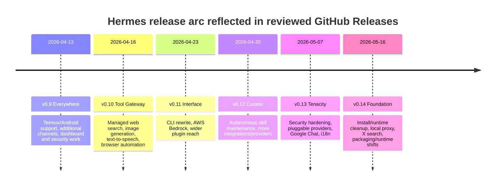
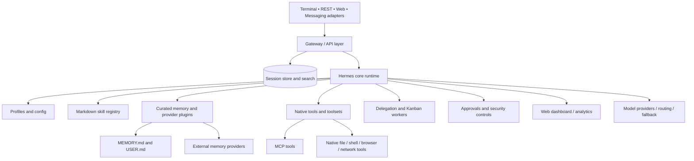
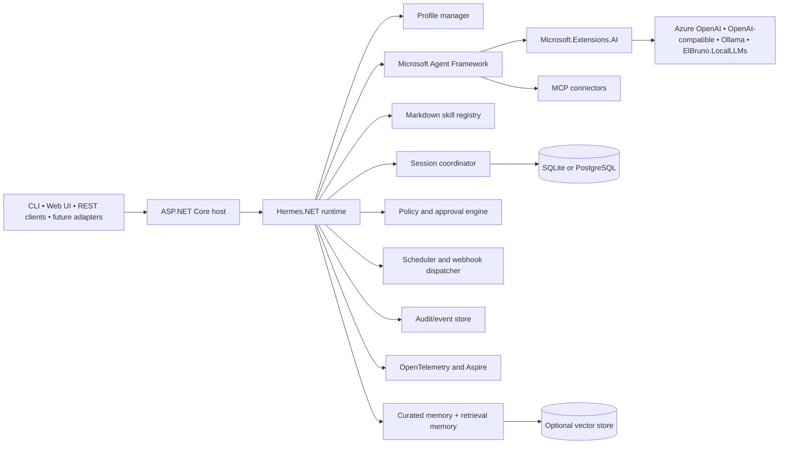
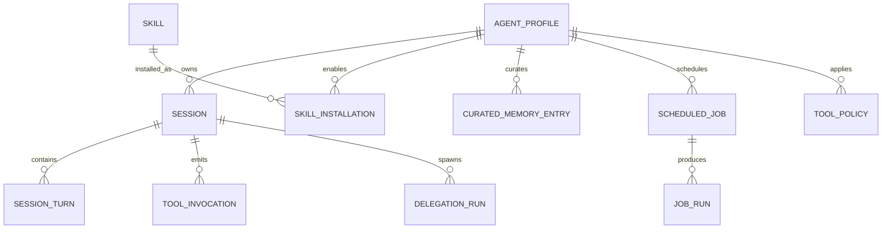
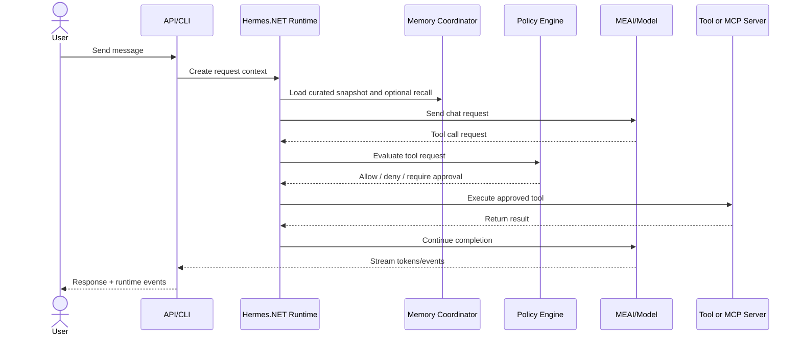
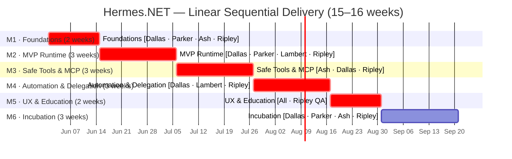

# Hermes.NET Reference PRD

*Recommended filename: `docs/PRD-Hermes.NET.md`*  
*Review date: 2026-05-22*  
*Language: en-US*  
*Scope: file-ready Markdown for direct use in a GitHub repository and with GitHub Copilot*  

## Executive Summary

Hermes Agent is an open-source AI agent runtime from Nous Research with a notably **productized** architecture: instead of stopping at model abstraction or tool calling, it combines profiles, durable sessions, markdown-driven skills, curated memory, pluggable external memory, MCP integration, automation entry points, broad messaging adapters, operator workflows, and a web dashboard into a single runtime surface.[^1][^2][^3][^4] In the reviewed official materials, the canonical public sources are the main `NousResearch/hermes-agent` repository, the official Hermes documentation site, GitHub Releases, the contributor/security documents in the repository, and the related but separate `hermes-agent-self-evolution` repository.[^1][^2][^13][^15][^16][^35]

For a .NET 10 reference implementation, the central architectural conclusion is that Hermes should be interpreted as a **layer above** Microsoft’s new AI and agent primitives, not as a one-to-one port target. Microsoft Agent Framework already provides strong foundations for agents, sessions, workflows, tool composition, MCP, hosting, and observability; Microsoft.Extensions.AI already provides provider-agnostic chat, embeddings, streaming, function invocation, dependency-injection integration, and telemetry hooks.[^17][^18][^19][^20][^21] The Hermes-specific value to implement in .NET is therefore concentrated in the higher-order runtime patterns: markdown skills, curated `MEMORY.md` and `USER.md`, profile-centric orchestration, tool-safety policy and approvals, practical automation surfaces, and an educational-but-real operator experience.[^4][^5][^6][^7]

The most defensible open-source strategy is to build **Hermes.NET** as a Hermes-inspired reference runtime on top of Microsoft Agent Framework and Microsoft.Extensions.AI, with optional local-first accelerators from El Bruno’s packages. The first release should intentionally stay small and clear: profiles, sessions, markdown skills, curated memory, native and MCP tools, approval-driven safety, REST plus CLI, and first-class OpenTelemetry. Broader messaging parity, full dashboard parity, and durable Kanban-style collaboration should be explicitly staged later.[^5][^6][^9][^17][^21][^30][^31][^32]

The comparison table below summarizes the strategic mapping that drives the rest of this PRD. The table synthesizes the reviewed Hermes docs, Microsoft docs, and NuGet package pages as of 2026-05-22.[^3][^4][^17][^19][^21][^22][^25][^30]

| Dimension | Hermes Agent | Microsoft Agent Framework | Microsoft.Extensions.AI | El Bruno Local packages | Hermes.NET design implication |
|---|---|---|---|---|---|
| Architectural level | Product/runtime for “agents that do things” | Agent framework/runtime substrate | AI abstraction layer | Local-first extensions aligned to Microsoft abstractions | Treat Hermes.NET as a product layer over MAF + MEAI |
| Provider/model abstraction | Strong, multi-provider, routing/fallback oriented | Agent-level provider model | `IChatClient`, embeddings, streaming, function invocation | Local model/embedding options | Solve provider plumbing in MEAI |
| Sessions/persistence | Strong, documented SQLite-centric session model | Strong runtime/session model | Not a session framework by itself | Optional helpers only | Use MAF + app persistence |
| Tools | Broad tool registry/toolsets | Function tools, code/file/web tools, approvals | Provider-agnostic tool calling | Local MCP and local-first helpers available in ecosystem | Centralize tools through a policy-aware registry |
| MCP | First-class | First-class | Indirect via tool layer | MCP-related packages exist in profile; specifics partly unspecified here | Prefer MAF MCP support |
| Skills | First-class markdown system | No direct equivalent | No direct equivalent | No direct equivalent | Implement custom skill subsystem |
| Curated memory | First-class via files | No direct equivalent | No direct equivalent | Compatible with custom layer | Recreate directly |
| External memory | Plugin providers | Context providers and vector-memory patterns | Works with embedding/vector ecosystem | Local embeddings helpful | Add pluggable retrieval layer |
| Durable collaboration | Kanban and delegation | Workflows/multi-agent patterns, but no Hermes Kanban product surface | None | None direct | Defer beyond MVP |
| Messaging breadth | Broad official channel list | Not core product focus | Not applicable | None direct | Stage later |
| Observability | Logs/analytics documented; standards-based tracing surface less explicit | Strong OTel story | Strong telemetry hooks | Compatible | Improve materially on Hermes here |
| Local-first story | Strong in runtime/docs | Depends on chosen provider/tooling | Strong abstraction model | Especially strong | Make local-first tutorials a first-class goal |

## Hermes Ecosystem Research

### Official repos, docs, community surfaces, and changelogs

The reviewed official Hermes ecosystem has a clear center of gravity. The main repository is the implementation and issue hub, the docs site is the canonical feature and developer reference, GitHub Releases is the effective public change history, and the contributor/security documents define the current maintainer-led governance expectations.[^1][^2][^13][^15][^16] The related `hermes-agent-self-evolution` repository appears to be an adjacent optimization/evolution project rather than the core runtime itself, so Hermes.NET should treat it as ecosystem-adjacent, not baseline scope.[^35]

| Surface | Status in reviewed official sources | Relevance to Hermes.NET |
|---|---|---|
| `NousResearch/hermes-agent` | Canonical core repository | Primary code and issue source |
| Hermes docs site | Canonical user/developer documentation | Primary design source |
| GitHub Releases | Primary public release/change surface | Primary release timeline |
| Contributor guide | Maintainer expectations and priority order | Useful governance baseline |
| Security policy | Official vuln reporting and disclosure stance | Strong baseline for repo policy |
| `hermes-agent-self-evolution` | Related but separate repo | Later-phase or adjacent exploration only |
| User Stories page | Official community examples and use cases | Good scenario input |
| Issues / Discussions references | Community discussion signal exists, but public Discussions availability was ambiguous in reviewed sources | Governance/documentation gap to improve in Hermes.NET |

Hermes’s community posture is active but only partly formalized in the official materials reviewed here. The docs include user stories and use cases, and the contributor guide encourages design discussion and contributions through the repository workflow. At the same time, a 2026 issue reports an unavailable Discussions surface, and a formal governance charter, RFC process, or CODEOWNERS-based review matrix was **unspecified** in the reviewed official sources.[^14][^15][^36] That matters because Hermes.NET should be stricter than Hermes here: clear ownership, contribution lanes, and release rules will improve OSS sustainability.

Hermes’s changelog surface is rich but fragmented. The official project publishes substantive GitHub Releases and release-note markdown such as version-specific release documents, but a single canonical `CHANGELOG.md` was **unspecified** as the primary public source of change history in the reviewed material.[^13] Hermes.NET should therefore preserve rich release notes but also add a consolidated changelog for contributor ergonomics.

### Release trajectory and what it implies

The reviewed public releases show a rapid, product-expanding phase from April through May 2026. The releases emphasize broadening platform reach, Tool Gateway features, CLI and plugin changes, Curator-centric skill maintenance, security hardening, more providers, a local proxy, and runtime/packaging cleanups.[^13] That pattern suggests Hermes is still evolving across multiple fronts at once, which is a strong argument against promising feature parity in a first .NET implementation.



The release trajectory supports a pragmatic scope boundary for Hermes.NET: it should focus first on the Hermes concepts that are both central and architecturally stable in the docs—profiles, sessions, tools, skills, curated memory, safe action, automation entry points, and observability—while treating broad messaging/channel parity and durable Kanban-style collaboration as later phases.[^3][^4][^5][^6][^9][^13]

### Supported scenarios and example use cases

Hermes’s own docs demonstrate several concrete scenario families: terminal-first assistants, GitHub PR review agents, automation via tools and webhooks, broad messaging-based assistants, library embedding, and durable collaboration through Kanban workers.[^7][^8][^9][^10][^12][^37] These examples are more useful as **behavioral reference points** than as code templates for .NET.

| Scenario family | Official evidence | Hermes.NET priority |
|---|---|---|
| Terminal-first assistant | Core docs and feature pages | Highest |
| GitHub PR review agent | Dedicated official guide | Highest |
| Tool-rich research and automation assistant | Tools/security/features docs | Highest |
| Embedded library usage | Python library guide shows the pattern | High, but translated to .NET |
| Scheduled and event-driven operations | Features and release notes | High |
| Durable collaboration with Kanban workers | Dedicated feature docs | Medium-Later |
| Broad messaging/channel adapters | Messaging docs list many platforms | Later |
| Voice/media/tool-gateway scenarios | Release notes mention TTS/media-like features | Later |
| Autonomous self-evolution / curator workflows | Related repo and release notes | Later or adjacent repo |

A useful architectural interpretation follows from these scenarios. Hermes separates **transport** from **runtime state and policy**. Messaging breadth is important, but it is not the center of the runtime; the durable center is profiles, session state, tools, skills, memory, and safety. Hermes.NET should preserve that separation from day one by making transport adapters thin and runtime services thick.[^4][^9][^10]

## Feature Inventory and Compatibility Analysis

### Full feature inventory

The table below consolidates the Hermes features that are visible in the reviewed official docs and release surfaces. It deliberately distinguishes between areas that are well specified and areas that are only partly specified. When the official sources do not make a stable architectural claim, the item is marked **unspecified** rather than embellished.[^3][^4][^5][^6][^7][^8][^9][^10][^11][^13]

| Area | What the reviewed official sources show | Specificity in official docs | Hermes.NET interpretation |
|---|---|---|---|
| Profiles | Distinct profiles/configurations are core to runtime behavior | Specified | Recreate directly |
| Sessions | Durable sessions, SQLite-backed persistence/search | Specified | Recreate directly |
| Provider abstraction | Strong multi-provider story with routing/fallback | Partly specified | Use MEAI `IChatClient` |
| Agent types | Practical roles exist, but stable formal taxonomy is **unspecified** | Partly specified | Model roles as profiles, jobs, delegated runs, and worker processes |
| Tools/toolsets | Broad central registry and documented toolsets | Specified | Build unified registry with policy metadata |
| MCP integration | Strong support and integration references | Specified | Use MAF MCP support |
| Skills | Markdown-first skills are a signature surface | Specified | Recreate as first-class |
| Curated memory | `MEMORY.md` and `USER.md`, memory tool, system-prompt inclusion | Specified | Recreate directly |
| External memory providers | Plugin memory providers, one active at a time | Specified | Add pluggable retrieval/context adapter layer |
| Planning | Planning behavior exists, but a standalone planner subsystem is **unspecified** | Partly specified | Add an explicit plan artifact layer in Hermes.NET |
| Delegation | Subtask delegation and child execution flows exist | Partly specified | Add child-run orchestration |
| Durable collaboration | Kanban-backed workers with auditable durable state | Specified | Stage after MVP |
| Automation | Scheduler/webhook-like operational entry points are evident | Partly specified | Add jobs + webhooks in second phase |
| Messaging adapters | Many channels officially listed | Specified | Stage later |
| Web dashboard | Logs/analytics/operator UX documented | Specified | Build lighter reference UI first |
| Safety/security | Detailed multi-layer safety model | Specified | Borrow directly and enhance through .NET middleware |
| Observability/telemetry | Dashboard logs/analytics documented; standards-based tracing surface is less explicit and partly **unspecified** | Partly specified | Make OTel first-class from day one |
| Licensing | MIT | Specified | Keep MIT |
| Governance | Maintainer-led contribution flow; formal governance charter/RFC process **unspecified** | Partly specified | Add clearer governance in Hermes.NET |

Two Hermes concepts deserve special emphasis because they are both distinctive and easy to underestimate. The first is **curated memory**. Hermes has a memory story even without a vector database because `MEMORY.md` and `USER.md` function as durable, human-readable, profile-scoped context that the runtime injects into the session prompt.[^5] The second is **orchestration plurality**. Hermes uses lighter-weight delegation for bounded subtasks and a separate Kanban model for durable, resumable, auditable collaboration. Those should not be collapsed into one abstraction in .NET.[^9]

### Reconstructed architecture from official docs

Because no single stable official architecture image URL was identified in the reviewed sources, the document uses Mermaid diagrams instead of hotlinked screenshots. The diagram below reconstructs the core component relationships described across the Hermes architecture, memory, tools, security, and dashboard docs.[^4][^5][^6][^8][^11]



The diagram highlights why a literal “SDK port” would miss the point. Hermes is not organized as a single thin agent class. It is organized as a runtime that composes policy, memory, tools, profiles, automation, and operator surfaces around the LLM interaction loop.[^4]

### Compatibility and gaps with Microsoft Agent Framework, Microsoft.Extensions.AI, and El Bruno packages

Microsoft Agent Framework is the best official foundation for Hermes.NET because it directly addresses many of the same primitives Hermes needs: agent abstraction, sessions, tools, MCP, remote/local patterns, workflows, hosting, and OpenTelemetry-based observability.[^17][^18][^19][^20] Microsoft.Extensions.AI is the right foundation below that because it provides provider-agnostic chat/model abstractions, embeddings, streaming, and function invocation, with builder-based composition and DI-friendly integration.[^21][^25][^26][^27] El Bruno’s packages are additive because they preserve Microsoft’s abstractions while dramatically improving the local-first story.[^30][^31][^32]

| Hermes concern | Best-fit mapping | Gap assessment | Notes |
|---|---|---|---|
| Model/provider independence | MEAI `IChatClient` and provider packages | Low | Strong official fit |
| Agent host/runtime | Microsoft Agent Framework | Low | Strong fit for sessions, orchestration, hosting |
| Native function tools | MAF tools + MEAI function invocation | Low | Make these the default tool path |
| MCP | MAF MCP support | Low | Avoid custom MCP plumbing unless necessary |
| Profiles | Custom Hermes.NET layer over MAF | Medium | Product concept, not a built-in MAF concept |
| Markdown skills | Custom Hermes.NET subsystem | High | Signature Hermes concept |
| Curated memory files | Custom Hermes.NET subsystem | High | Signature Hermes concept |
| Retrieval memory | MAF context providers + VectorData | Medium | Good substrate, custom policy layer needed |
| Delegation | MAF orchestration/workflows + child-run store | Medium | Requires application-level semantics |
| Durable Kanban collaboration | Custom area | High | No direct parity surface |
| Dashboard/operator UX | ASP.NET Core + Aspire + OTel + custom UI | Medium | Build lighter reference UI first |
| Messaging breadth | Custom adapters | High | Explicitly defer |
| Standards-based observability | MAF + OTel + MEAI hooks | Low | Opportunity to exceed Hermes baseline |
| Local-first path | El Bruno LocalLLMs + LocalEmbeddings | Low-Medium | Optional accelerators but very valuable |

The largest **nonsubstrate** gaps are markdown skills, curated memory, and Hermes-style durable collaboration. The largest **substrate** opportunity is observability. Hermes.NET should therefore keep as much as possible on official Microsoft abstractions while expressing Hermes’s product semantics in a small number of custom layers above them.[^4][^5][^9][^17][^21]

### Package choices

The table below consolidates the package choices that are most appropriate for a .NET 10 Hermes.NET reference implementation, based on the reviewed official Microsoft docs and NuGet feeds plus El Bruno’s public NuGet profile. Versions shown are those visible in the reviewed package pages on 2026-05-22.[^22][^23][^24][^25][^26][^27][^28][^29][^30][^31][^32][^33][^34]

| Role | Package | Version visible in reviewed source | Recommendation | Rationale |
|---|---|---:|---|---|
| Agent runtime | `Microsoft.Agents.AI` | 1.6.1 | Required | Core agent abstractions |
| ASP.NET host | `Microsoft.Agents.Hosting.AspNetCore` | 1.0.1 | Required | API hosting and integration |
| Workflows | `Microsoft.Agents.AI.Workflows` | 1.0.0-rc1 | Optional after MVP | Useful for delegated/durable flows |
| AI abstraction | `Microsoft.Extensions.AI` | 10.6.0 | Required | Provider-agnostic AI core |
| OpenAI-compatible client | `Microsoft.Extensions.AI.OpenAI` | 10.6.0 | Required for first provider path | Practical starting provider |
| Vector abstractions | `Microsoft.Extensions.VectorData.Abstractions` | 10.6.0 | Optional in MVP; required when retrieval arrives | Retrieval/memory substrate |
| Local orchestration | `Aspire.Hosting.AppHost` | 13.3.3 | Strongly recommended | Excellent local-first app topology |
| OTel hosting integration | `OpenTelemetry.Extensions.Hosting` | 1.15.3 | Required | Standards-based observability |
| Local LLM path | `ElBruno.LocalLLMs` | 0.16.0 | Optional but strongly recommended | Strong educational/local offline story |
| Local embeddings path | `ElBruno.LocalEmbeddings.VectorData` | 1.4.6 | Optional but strongly recommended | Simple local recall story |
| Structured memory exploration | `MemPalace.Core` | 0.15.2 | Optional | Useful optional memory experimentation |
| Additional El Bruno MCP/Realtime packages | Present in profile, but precise recommendation and version are **unspecified** in this PRD unless reviewed directly | **Unspecified** | Evaluate later | Keep MVP dependency graph smaller |

For this PRD, intentionally official-first package selection is a feature, not a limitation. If a capability can be expressed cleanly on MAF plus MEAI, Hermes.NET should prefer that over introducing a custom or niche dependency. Where official packages are weaker—especially markdown skills and curated memory—the right answer is a small, well-documented first-party subsystem, not a dependency spree.

## Hermes.NET Product Requirements Document

### Product vision, assumptions, target users, and success metrics

**Product vision.** Hermes.NET is an open-source, educational, production-adjacent reference implementation for .NET 10 that demonstrates how to recreate the most architecturally important Hermes concepts on top of Microsoft Agent Framework and Microsoft.Extensions.AI: profiles, sessions, markdown skills, curated memory, native and MCP tools, safe action via policy/approvals, and practical automation.[^4][^5][^6][^7][^17][^21]

**Non-goal.** Hermes.NET is **not** a promise of perfect parity with the Python runtime, broad messaging parity, or full dashboard/Kanban parity. Those areas are either separate product surfaces or still moving in Hermes’s own public release cadence.[^9][^10][^13]

**Assumptions.** The assumptions below are explicit so that GitHub Copilot, contributors, and maintainers have a shared frame of reference.

| Assumption | Why it is used in this PRD |
|---|---|
| .NET 10 is the target runtime | User requirement and current official .NET 10 availability page reviewed |
| MAF and MEAI are preferred foundations | They best match official Microsoft direction for agents and AI abstractions |
| Hermes should be treated as a product layer | Its differentiation is above low-level provider/tool plumbing |
| SQLite-first is the default persistence mode | Matches Hermes’s documented runtime style and supports local-first education |
| Items not specified in official Hermes docs remain **unspecified** | Prevents accidental invention of false parity claims |
| Local-first demos matter | They materially improve OSS onboarding and Copilot usefulness |
| Observability is a first-class differentiator | MAF and OTel make it straightforward to improve on Hermes’s current documented baseline |

**Target users.**

| User type | Primary need | Why Hermes.NET fits |
|---|---|---|
| .NET developers | A readable, modern agent reference runtime | Uses official Microsoft abstractions |
| Educators / advocates | A local-first, explainable demo project | Skills and curated memory are easy to teach |
| OSS contributors | Clear extension points and contributor guidance | Reference implementation design |
| Internal platform teams | A starting point for safe, tool-rich agent apps | Profiles, policy, telemetry, storage are all explicit |

**Success metrics.**

| Metric | Target |
|---|---:|
| First successful local chat after clone | under 10 minutes |
| Add one native tool and see it invoked | under 30 minutes |
| Add one MCP server and validate it | under 30 minutes |
| Author and enable a new markdown skill | under 20 minutes |
| Session resume/search works end-to-end | yes in MVP |
| Core runtime automated coverage | at least 80% |
| OTel coverage on critical flows | at least 90% of runtime paths |
| Sample apps shipped | at least 4 |
| Required docs present | architecture, getting started, skills, memory, tools, security, telemetry, deployment, contributing |

### Functional requirements

The functional requirements below preserve the highest-value Hermes concepts while keeping the MVP narrow enough to be teachable.

| Area | Requirement |
|---|---|
| Profiles | Support multiple named profiles with isolated configuration, model defaults, enabled skills, and memory scope |
| Sessions | Persist sessions, turns, summaries, tool calls, approvals, and searchable metadata |
| Chat loop | Support streaming and non-streaming interactions |
| Skills | Load markdown skills from disk, validate YAML front matter, resolve by trigger/name, and enable per profile |
| Curated memory | Implement profile-scoped `MEMORY.md` and `USER.md` with read/update policy |
| Retrieval memory | Support optional pluggable long-term recall via vector/context providers |
| Tools | Support native function tools, MCP tools, and policy-tagged file/network/exec tools |
| Planning | Support explicit plan artifacts before multi-step execution when required by profile or skill |
| Delegation | Support bounded child runs for subtasks with parent-child lineage |
| Automation | Support scheduled jobs and inbound webhook entry points |
| API | Expose REST endpoints and SSE or WebSocket event streaming |
| CLI | Provide a first-class terminal UX |
| Web UI | Provide a minimal operator UI for sessions, jobs, skills, tool activity, and traces |
| Audit | Persist approval decisions, denials, tool executions, and config changes as structured audit events |
| Admin | Support profile and skill management with role-appropriate controls |

### Non-functional requirements

| Area | Requirement |
|---|---|
| Simplicity | The core architecture should be understandable by an experienced .NET engineer in a few hours |
| Cross-platform | Linux, macOS, and Windows supported |
| Local-first | Full demo flow must work without cloud dependence |
| Extensibility | New tools, skills, providers, and memory backends must be pluggable |
| Reliability | Sessions and background jobs survive restart |
| Observability | OTel traces, metrics, and logs are built in from day one |
| Privacy | Sensitive message/tool payloads are not logged by default |
| Security | Tool access is policy-gated; dangerous actions fail closed |
| Maintainability | Central package management, analyzers, docs, and tests are enforced |
| OSS usability | Clear contributor guide, CODEOWNERS, issues, roadmap, and release notes |

### Minimal reference architecture

The diagram below is the minimal architecture for the Hermes.NET repository. It intentionally keeps Microsoft’s official packages as the substrate and puts Hermes-specific value in explicit upper layers.[^17][^19][^21]



### API surface

The API surface should stay intentionally small in the first release, but it must already reflect the product model: profiles, sessions, skills, tools, jobs, and event streaming.

| Method and route | Purpose | MVP |
|---|---|---|
| `POST /api/profiles` | Create or upsert a profile | Yes |
| `GET /api/profiles` | List profiles | Yes |
| `GET /api/profiles/{id}` | Get profile details | Yes |
| `POST /api/sessions` | Create session under a profile | Yes |
| `GET /api/sessions/{id}` | Get session metadata/summary | Yes |
| `POST /api/sessions/{id}/messages` | Send a user message | Yes |
| `GET /api/sessions/{id}/events` | Stream runtime events | Yes |
| `GET /api/sessions/search?q=` | Search summaries and metadata | Yes |
| `GET /api/skills` | List available/installed skills | Yes |
| `POST /api/skills/install` | Install/register skill | Yes |
| `GET /api/tools` | List tool inventory visible to current profile | Yes |
| `POST /api/jobs` | Create scheduled job | Phase Two |
| `GET /api/jobs` | List jobs and last runs | Phase Two |
| `POST /api/webhooks/{name}` | Webhook-triggered entry point | Phase Two |
| `GET /healthz` | Liveness | Yes |
| `GET /readyz` | Readiness | Yes |
| `GET /metrics` | Metrics endpoint | Yes |

### SDK interfaces

The runtime interfaces below are intended for first-party code, host integration, and contributor extension points. They are proposal interfaces, not official Hermes contracts.

```csharp
public interface IHermesRuntime
{
    Task<SessionHandle> CreateSessionAsync(
        string profileId,
        CancellationToken cancellationToken = default);

    IAsyncEnumerable<RuntimeEvent> SendAsync(
        string sessionId,
        UserMessage input,
        CancellationToken cancellationToken = default);
}

public interface ISkillRegistry
{
    Task<IReadOnlyList<SkillManifest>> ListAsync(
        string profileId,
        CancellationToken cancellationToken = default);

    Task<SkillManifest?> ResolveAsync(
        string profileId,
        string triggerOrName,
        CancellationToken cancellationToken = default);
}

public interface IMemoryCoordinator
{
    Task<CuratedMemorySnapshot> GetCuratedSnapshotAsync(
        string profileId,
        CancellationToken cancellationToken = default);

    Task<IReadOnlyList<MemoryRecall>> RecallAsync(
        string profileId,
        string query,
        CancellationToken cancellationToken = default);

    Task PersistTurnAsync(
        string profileId,
        SessionTurn turn,
        CancellationToken cancellationToken = default);
}

public interface IPolicyEngine
{
    Task<PolicyDecision> EvaluateToolCallAsync(
        ToolInvocation invocation,
        CancellationToken cancellationToken = default);
}
```

The interface split is deliberate. Hermes’s architecture clearly distinguishes runtime orchestration, memory coordination, tools, and policy concerns, and those seams map naturally to extension points in .NET.[^4][^5][^6]

### Data model, storage, and memory design

The entity model below is the minimum required to express Hermes-like runtime behavior while keeping the implementation understandable.



| Entity | Key fields |
|---|---|
| `AgentProfile` | `Id`, `Name`, `Description`, `DefaultModel`, `WorkspacePath`, `EnabledSkillSet`, `ToolPolicySet` |
| `Session` | `Id`, `ProfileId`, `Channel`, `Status`, `Summary`, `CreatedUtc`, `UpdatedUtc`, `TraceId` |
| `SessionTurn` | `Id`, `SessionId`, `Role`, `Content`, `TokenUsage`, `LatencyMs`, `CreatedUtc` |
| `ToolInvocation` | `Id`, `SessionId`, `ToolName`, `ArgsJson`, `ResultJson`, `Category`, `ApprovalState`, `DurationMs` |
| `Skill` | `Id`, `Name`, `Version`, `Source`, `MarkdownBody`, `MetadataJson` |
| `SkillInstallation` | `Id`, `ProfileId`, `SkillId`, `Enabled`, `Priority` |
| `CuratedMemoryEntry` | `Id`, `ProfileId`, `Kind`, `Content`, `Priority`, `UpdatedUtc` |
| `ScheduledJob` | `Id`, `ProfileId`, `Cron`, `Prompt`, `AttachedSkills`, `Enabled` |
| `JobRun` | `Id`, `JobId`, `StartedUtc`, `CompletedUtc`, `Status`, `Summary` |
| `DelegationRun` | `Id`, `ParentSessionId`, `ChildSessionId`, `Status`, `ResultSummary` |
| `ToolPolicy` | `Id`, `ProfileId`, `ToolPattern`, `AccessLevel`, `RequireApproval`, `AllowedDomains` |

**Storage strategy.**  
SQLite is the default operational store for the first release. It is the best fit for local-first education, aligns with Hermes’s documented SQLite-centric runtime patterns, and makes the repo easy to clone, run, and inspect.[^4] PostgreSQL should be a supported later adapter for cloud and team scenarios.

**Curated memory strategy.**  
Each profile owns `MEMORY.md` and `USER.md`. `MEMORY.md` stores durable environmental/project facts; `USER.md` stores user preferences and interaction norms. Both are human-readable, both are injected into session context at startup, and both can be updated through controlled memory actions. This follows Hermes’s official design and should remain available even when retrieval memory is disabled.[^5]

**Retrieval memory strategy.**  
Retrieval is optional. When enabled, it should sit behind a memory adapter layer implemented on `Microsoft.Extensions.VectorData`. The first local path should be simple and educational: local embeddings plus an in-memory or file-local vector store. More advanced backends can come later.[^21][^27][^32]

A simple workspace layout is recommended:

```text
/workspace
  /profiles/default
    profile.json
    MEMORY.md
    USER.md
    /skills
      pr-review.md
      research.md
  /data
    hermesnet.db
  /artifacts
    /sessions
    /jobs
  /logs
```

### Skill format and tool integration patterns

Markdown-first skills are one of the most important Hermes ideas to preserve because they make behavior visible, reviewable, versionable, and easy to author with Copilot.[^7]

```markdown
---
name: pr-review
description: Review a pull request diff and produce actionable feedback.
triggers:
  - review pr
  - inspect pull request
tools:
  - git.diff
  - github.comment
  - file.read
memory:
  curated: read
  retrieval: optional
safety:
  approval_required: false
---

# Role

You are a careful code reviewer.

# Workflow

1. Summarize the change.
2. Identify correctness, security, reliability, and maintainability risks.
3. Suggest concrete edits.
4. Produce a concise final review.
```

The tool model should centralize all tools—native tools and MCP tools—under one registry and attach policy metadata rather than building multiple dispatch paths.

| Pattern | Use case | Implementation path | Default approval posture |
|---|---|---|---|
| Native function tool | Deterministic local logic | `AIFunction` + DI service | No for read-only |
| Local file tool | File reads/writes under workspace policy | Native function wrapper | Read-only no; write yes |
| Network tool | Web/API access | Typed client + allowlist + SSRF checks | Usually yes unless allowlisted |
| Shell/exec tool | Bounded process execution | Sandboxed executor + audit trail | Always yes |
| MCP local tool | Existing local MCP server | MAF MCP connector | Depends on category |
| MCP hosted tool | Hosted or remote capability | MAF hosted MCP path | Usually yes |
| Retrieval tool | Semantic recall/context loading | Memory adapter | No for read-only |
| Webhook action tool | External mutation | Typed client + signed request policy | Yes |

**Illustrative registration pseudocode.**

```csharp
builder.Services.AddSingleton<IPolicyEngine, DefaultPolicyEngine>();
builder.Services.AddSingleton<ISkillRegistry, MarkdownSkillRegistry>();
builder.Services.AddSingleton<IMemoryCoordinator, DefaultMemoryCoordinator>();

builder.Services.AddChatClient(sp =>
{
    // Create provider-specific IChatClient through Microsoft.Extensions.AI
    return ChatClientFactory.CreateFromConfiguration(sp);
});

builder.Services.AddSingleton<AIFunction>(sp =>
    AIFunctionFactory.Create(
        nameof(ReadFileAsync),
        async (string path, CancellationToken ct) =>
        {
            var invocation = ToolInvocation.ReadOnly("file.read", new { path });
            var decision = await sp.GetRequiredService<IPolicyEngine>()
                .EvaluateToolCallAsync(invocation, ct);

            if (!decision.Allowed)
                throw new UnauthorizedAccessException(decision.Reason);

            return await File.ReadAllTextAsync(path, ct);
        }));
```

### Security model, privacy boundaries, and deployment model

Hermes’s safety design is one of the strongest areas in its official docs. The project documents layered controls including user authorization, dangerous command approval, container isolation, MCP credential filtering, prompt-injection scanning for context files, SSRF/URL controls, and supply-chain advisory checks.[^6] Hermes.NET should adopt that layered spirit directly.

| Security concern | Hermes.NET requirement |
|---|---|
| Authentication | Only authenticated users or trusted local modes may access profile/session APIs |
| Authorization | Profiles and admin actions require explicit authorization rules |
| Read-only tools | Allowed by policy and audited |
| Mutation tools | Require approval unless profile policy says otherwise |
| Shell/exec tools | Disabled by default outside sandbox; always approved in sandboxed mode |
| Network tools | Domain allowlists plus SSRF protections |
| Secrets | Never logged in plaintext; never added to model context unless explicitly scoped |
| Imported skills/context | Scan for prompt-injection patterns before activation |
| MCP credentials | Filter and scope credentials per server/tool |
| Supply chain | Dependency scanning in CI plus startup package diagnostics where feasible |

| Privacy boundary | Default |
|---|---|
| Raw prompt/response logs | Off |
| Derived metrics and timings | On |
| Trace/span correlation IDs | On |
| Tool args/results for sensitive tools | Redacted |
| Session transcript retention | Configurable per profile |
| Provider-side retention behavior | Depends on provider; **unspecified** by this PRD unless documented by the configured provider |

The deployment story should support three modes:

| Mode | Description | Priority |
|---|---|---|
| Local developer mode | Aspire + SQLite + local or OpenAI-compatible provider | Highest |
| Single-node container mode | Docker Compose with API, UI, DB, telemetry collector | High |
| Cloud-native mode | Azure Container Apps or AKS with PostgreSQL/vector backend | Later |

### Observability, testing, CI/CD, and Copilot-ready repository shape

Hermes’s official docs clearly expose dashboard logs and analytics, but they do not provide as explicit a standards-based tracing story as Microsoft Agent Framework does in its observability documentation.[^11][^20] Hermes.NET should therefore make OTel-native observability a design requirement, not an afterthought.

**Telemetry plan.**

| Signal | Emitted for |
|---|---|
| Traces | session start/end, message build, model invocation, tool invocation, MCP call, memory recall, memory persist, approval, job execution, webhook entry, delegation |
| Metrics | token usage, latency, error rate, tool counts, denials, active sessions, job queue depth |
| Structured logs | startup, configuration, skill loading, adapter registration, policy decisions, failures |
| Audit events | approvals, denials, profile changes, secret access, config changes, job outcomes |

A useful mental model for contributors is the runtime sequence below.



**Testing strategy.**

| Layer | What to validate |
|---|---|
| Unit tests | skill parsing, memory merge rules, policy decisions, tool metadata, profile loading |
| Contract tests | HTTP contracts, event stream schema, error responses |
| Integration tests | SQLite store, selected provider path, MCP registration/execution |
| Transcript tests | Deterministic transcripts under fixed prompts/system content |
| Security tests | SSRF blocking, write/exec approvals, secret redaction, prompt-injection scanning |
| End-to-end tests | console agent, web API agent, MCP demo, offline-local demo |

**CI/CD requirements.**

| Stage | Required actions |
|---|---|
| Validation | restore, build, analyzers, tests, formatting |
| Security | dependency scan, container scan, secret scan |
| Packaging | API and sample container builds, package validation |
| Docs | link validation, Mermaid lint/render validation where feasible |
| Release | release notes, changelog, tagged artifacts |

**Copilot-ready repository shape.**

```text
/.github
  /workflows
  /ISSUE_TEMPLATE
  CODEOWNERS
  copilot-instructions.md
/docs
  PRD-Hermes.NET.md
  architecture.md
  security.md
  skills.md
  memory.md
  tools-and-mcp.md
  telemetry.md
  deployment.md
/src
  HermesNet.Api
  HermesNet.Runtime
  HermesNet.Skills
  HermesNet.Memory
  HermesNet.Tools
  HermesNet.Persistence
  HermesNet.Telemetry
/samples
  ConsoleAgent
  WebApiAgent
  McpToolsDemo
  OfflineLocalAgent
/tests
  HermesNet.UnitTests
  HermesNet.IntegrationTests
```

Suggested `copilot-instructions.md` seed:

```markdown
- Prefer Microsoft.Agents.* and Microsoft.Extensions.AI abstractions over custom wrappers.
- Do not bypass IPolicyEngine for write, network, or exec tools.
- Skills are Markdown with YAML front matter and must remain human-readable.
- Curated memory lives in MEMORY.md and USER.md per profile.
- All new endpoints must emit telemetry and audit events.
- Treat undocumented Hermes behavior as unspecified; do not invent parity features.
```

### Licensing and contributor guidelines

Hermes Agent is MIT-licensed, and its contributor guide states that contributions are licensed under MIT.[^15][^16] Hermes.NET should follow the same model. The stronger recommendation is to improve on governance clarity even while keeping the licensing simple.

| Area | Hermes.NET recommendation |
|---|---|
| License | MIT |
| Security reporting | Private disclosure channel + Security Advisories |
| CODEOWNERS | Required |
| Issue templates | Bug, feature, docs, question |
| ADRs | Lightweight architecture decision records for major subsystems |
| Release notes | Required per release |
| Changelog | Consolidated `CHANGELOG.md` required |
| Roadmap | Publish first-phase roadmap and backlog priorities |
| Review rules | At least one maintainer review for core runtime changes |

## Phased Implementation Plan

### Overview

Hermes.NET follows a **strictly linear, sequential delivery model**. Each milestone is a formal gate: the team does not advance until all quality gates, exit criteria, and risk validations are GREEN. This model trades theoretical calendar speed for predictability, stability, and unambiguous accountability. A failed gate triggers a bounded fix window (3–5 working days maximum) before re-validation. If re-validation fails, Ripley reduces scope and documents known limitations before proceeding.

> **Sequential chain:** Foundations → MVP Runtime → Safe Tools & MCP → Automation & Delegation → UX & Education → Incubation

Total estimated duration: **15–16 weeks**. No milestone begins until the previous one receives a Go/No-Go decision from Ripley.

---

### Delivery Phases Table

| Phase | Duration | Deliverables | Milestone | Blocker for Next Phase |
|---|---:|---|---|---|
| Foundations | 2 weeks | solution structure, central packages, provider path, SQLite session store, OTel baseline | local chat works | Session store load-tested ≥ 1,000 sessions; OTel traces visible; R1 + R5 GREEN; Ripley Go |
| MVP Runtime | 3 weeks | profiles, sessions, markdown skills, curated memory, native tool registry, REST API, CLI | first public MVP | All core Hermes concepts working end-to-end; R2 + R4 GREEN; Ripley Go |
| Safe Tools & MCP | 3 weeks | policy engine, approvals, URL policy, redaction, MCP integration, audit events | safe tooling story | Adversarial tests 100% pass; audit events on every tool call; R3 GREEN; Ripley + Ash Go |
| Automation & Delegation | 3 weeks | scheduled jobs, webhook entry points, child runs, parent-child lineage | automation story | Jobs reliable over 1-hour run; webhooks < 500 ms; no M1–M3 regression; Ripley Go |
| UX & Education | 2 weeks | minimal web UI, Aspire app host, walkthrough docs, four sample apps | educational release | All samples run from cold clone; getting-started validated by first-time developer; Ripley Go |
| Incubation | 3 weeks | vector memory, local LLM, local embeddings, Kanban prototype | vNext preview | No M1–M5 regression; all incubation code marked experimental; Ash security review complete; Ripley Go |

**MVP scope.**  
The MVP (Milestones 1–5) includes profiles, sessions, markdown skills, curated memory, native function tools, MCP, policy approvals, REST plus CLI, audit events, and full observability. It explicitly excludes broad messaging adapters, full dashboard parity, production multi-tenant admin, durable Kanban parity, and autonomous self-evolution. These exclusions are intentional and correct for a first OSS reference release.[^5][^7][^9][^10][^13]

---

### Risk Summary

The top five risks to Hermes.NET success, ranked by potential impact, with owners and the milestone where each is formally validated:

| # | Risk | Core Concern | Owner | Validated In |
|---|---|---|---|---|
| R1 | **Integration drift** — MAF/MEAI concepts don't map cleanly to Hermes semantics (profiles, curated memory, delegation) | Core architecture correctness; wrong mapping here poisons every milestone above it | Ripley | Milestone 1 — Week 1 |
| R2 | **Curated memory semantics** — MEMORY.md/USER.md model loses value in translation; profile scoping unclear | Signature Hermes concept; if ambiguous, the memory layer is unreliable for end users | Parker | Milestone 2 — Week 1 |
| R3 | **Policy engine complexity** — Safety model too complex for .NET abstraction, or licensing/compliance requirements block release | Safety-critical; policy must be correct, idiomatic, and auditable | Ash | Milestone 3 — Week 1 |
| R4 | **Performance regression** — OTel overhead or session query scale causes noticeable latency | Performance differentiator; if the agent feels slow, educational value suffers | Parker | Milestone 2 — Week 1 (re-baseline from M1) |
| R5 | **Skill system brittleness** — YAML parsing, validation, or versioning breaks under edge cases; session query performance degrades at scale | Reliability for demo and production loads; brittle skills undermine every scenario | Dallas | Milestone 1 — Week 2 |

**Go/No-Go Protocol:** Ripley validates all risk checkpoint results at the designated milestone. A failed checkpoint blocks milestone progression until resolved (max 3 working days). If unresolvable, Ripley reduces scope and escalates. No milestone ships with an open RED risk checkpoint.

---

### Milestone 1: Foundations (2 weeks)

**Team:** Dallas (session store lead), Parker (OTel lead), Ash (provider audit), Ripley (architecture validation)  
**Goal:** Establish the technical foundation. Local chat works end-to-end. R1 and R5 are validated before any Hermes-specific code is written.

#### Overview

Foundations is the most structurally critical milestone. Everything else depends on it. The goal is not features — it is confidence: that the solution builds cleanly across all platforms, that the MAF provider path works, that the session store will hold up at scale, and that OTel is wired from day one. Ripley validates that MAF abstractions map cleanly to Hermes concepts (R1) in Week 1. Dallas load-tests SQLite with 1,000+ sessions before any Skills work begins (R5).

#### Deliverables

- Solution structure and central `Directory.Build.props` / `Directory.Packages.props`
- Default `IChatClient` provider path (OpenAI-compatible + local Ollama)
- SQLite session store with basic CRUD
- OTel baseline: traces, metrics, and logs to local collector
- Local CLI chat interaction (end-to-end): CLI → Session → Provider → Response

#### Quality Gates — Milestone 1: Foundations

| Gate | Target | How Measured | Owner |
|---|---|---|---|
| Core runtime unit tests | ≥ 80% coverage on session store and provider path | `dotnet test --collect:"XPlat Code Coverage"` | Dallas |
| OTel trace coverage | 100% of chat loop, provider call, and session save emit traces | Aspire dashboard + manual trace walk; trace count vs. code path count | Parker |
| Build cleanliness | Zero warnings, zero test failures on Linux / macOS / Windows | CI build matrix output; `dotnet build -warnaserror` | Dallas |
| Performance baseline | < 100 ms agent response loop latency (local provider, no load) | Benchmark runner; result recorded as M1 baseline for M2 regression comparison | Parker |
| Security baseline | No hardcoded secrets; all direct dependency versions current | `dotnet list package --vulnerable --include-transitive`; secret scanner in CI | Ash |
| Session load test | SQLite handles 1,000+ concurrent sessions without query degradation | Custom load script: insert 1,000 sessions, query by ID and recency; P95 latency documented | Dallas |
| Dependency audit | Zero critical CVEs in direct and transitive dependencies | `dotnet list package --vulnerable --include-transitive`; fail build if critical found | Ash |

#### Exit Criteria (Definition of Done)

- ✅ Solution builds cleanly on Linux, macOS, and Windows
- ✅ SQLite session store tested; basic CRUD verified; load-tested with 1,000+ sessions (P95 latency documented)
- ✅ OpenAI-compatible provider path works with local Ollama
- ✅ OTel traces and metrics visible in local collector
- ✅ End-to-end local chat interaction works from CLI
- ✅ R1 and R5 risk checkpoints PASSED
- ✅ All quality gates above are GREEN

**Go/No-Go:** Ripley verifies all exit criteria and gates. Pass → Milestone 2. Fail → team fixes within 3 working days, then re-validates. Second failure → Ripley reduces scope and documents known limitations.

#### Risk Validations — Milestone 1: Foundations

| Risk | Validation Checkpoint | How to Validate | Owner | Go/No-Go |
|---|---|---|---|---|
| R1: Integration drift | Can a complete E2E chat flow be built on MAF with Hermes concept semantics (profile, session, tool) mapping cleanly? | Spike: wire `IChatClient` → MAF session → tool response; confirm no concept mismatch forces a design rethink; Ripley reviews mapping | Ripley | If fails: halt, redesign profile abstraction before any Hermes-specific code is written |
| R5: Skill system / session scale | Does SQLite handle 1,000+ sessions without query degradation? Does YAML skill parsing handle malformed input gracefully? | Load test: insert 1,000 sessions, query by ID and recency, measure P95 latency; unit test: 5+ malformed YAML skill inputs rejected correctly | Dallas | If SQLite fails: evaluate PostgreSQL migration path and decide before M2 begins; if YAML brittle: harden parser before Skills layer builds on it |

---

### Milestone 2: MVP Runtime (3 weeks)

**Team:** Dallas (core runtime lead), Parker (curated memory lead), Lambert (test strategy), Ripley (acceptance review)  
**Goal:** First public MVP. All core Hermes concepts implemented and shippable.

#### Overview

MVP Runtime is the heart of Hermes.NET. The goal is a complete, shippable implementation of every core Hermes concept: profiles, sessions, markdown skills, curated memory, native tools, REST API, and CLI. Lambert leads test strategy — every feature that ships must have a corresponding test. Ripley's acceptance bar at the end is simple: can a developer who has never seen Hermes.NET clone the repo, run `dotnet run`, and have a working agent conversation?

#### Deliverables

- Profile and session management (CRUD, switching, multi-profile)
- Markdown skill parser and registry (YAML front matter validation)
- Curated memory loader/updater (`MEMORY.md` + `USER.md`)
- Native tool registry (read-only file/system tools; safe tool categories)
- REST API with SSE streaming
- CLI (`hermes chat`, `hermes session`, `hermes skill`, `hermes memory`)
- OTel instrumentation on all new paths

#### Quality Gates — Milestone 2: MVP Runtime

| Gate | Target | How Measured | Owner |
|---|---|---|---|
| Unit test coverage (profiles, sessions, skills, memory) | ≥ 80% on all four core modules | `dotnet test --collect:"XPlat Code Coverage"` scoped to each module | Lambert |
| OTel coverage (new flows) | ≥ 90% of new code paths emit traces | OTel dashboard audit; new span count vs. new code path count | Parker |
| Latency regression vs. M1 baseline | < 20% overhead with full OTel active vs. M1 recorded baseline | Benchmark re-run; P95 comparison against M1 baseline; delta documented | Parker |
| CLI smoke tests | All four core commands succeed without error or exception | `hermes chat`, `hermes session list`, `hermes skill list`, `hermes memory show` | Lambert |
| REST API contract tests | All endpoints tested; OpenAPI spec generated and validates | Postman collection or `dotnet test` integration tests; `dotnet-openapi verify` | Dallas |
| Markdown skill validation | Malformed YAML front matter rejected with clear error; valid skills execute | Unit tests: 5+ malformed inputs (missing fields, invalid types, extra keys) all rejected | Dallas |
| Curated memory profile scoping | MEMORY.md and USER.md load and scope correctly per profile; no cross-profile contamination | Integration test: 2 profiles with distinct memory files; confirm profile A cannot read profile B's memory | Parker |

#### Exit Criteria (Definition of Done)

- ✅ Profile and session CRUD works end-to-end
- ✅ Markdown skill loads, validates, and executes
- ✅ Curated memory loads and scopes correctly per profile; no cross-profile contamination
- ✅ Native tools execute with correct sandboxing
- ✅ REST API serves chat with SSE streaming
- ✅ CLI first-run experience works from `dotnet run`
- ✅ R2 and R4 risk checkpoints PASSED
- ✅ All quality gates above are GREEN

**Go/No-Go:** Ripley reviews MVP against public release readiness. Pass → Milestone 3. Fail → targeted fixes within 5 working days, then re-validate.

#### Risk Validations — Milestone 2: MVP Runtime

| Risk | Validation Checkpoint | How to Validate | Owner | Go/No-Go |
|---|---|---|---|---|
| R2: Curated memory semantics | Does the `MEMORY.md`/`USER.md` loader correctly scope memory per profile with no cross-profile contamination? | Integration test: create 2 profiles, give each distinct `MEMORY.md` content, confirm profile A cannot read profile B's memory; Parker documents canonical scoping behavior | Parker | If fails: Parker defines canonical scoping spec and re-implements before memory layer merges; do not proceed with multi-profile scenarios until this is GREEN |
| R4: OTel latency overhead | Does full OTel instrumentation add < 20% latency overhead vs. M1 baseline? | Benchmark re-run with all new OTel spans active; compare P95 latency to M1 recorded baseline; document delta | Parker | If overhead > 20%: Parker and Dallas optimize sampling strategy (e.g., adaptive sampling on high-frequency spans) before REST API layer is added |

---

### Milestone 3: Safe Tools & MCP (3 weeks)

**Team:** Ash (policy engine lead), Dallas (MCP integration), Ripley (audit model + go/no-go)  
**Goal:** Safe tooling story. Operators can trust every tool execution.

#### Overview

Safety is non-negotiable. Milestone 3 makes Hermes.NET trustworthy: every tool call passes through a policy engine, every decision is audited, and every MCP tool is registered through the same safe path. Ash owns the policy engine and leads the adversarial test suite — the bar is 100% pass, not 95%. Dallas wires MCP integration through the policy engine (no MCP tool bypasses policy). Ripley co-signs the security gate: no tool reaches production without both Ash and Ripley signing off.

#### Deliverables

- Policy engine: approvals, denials, URL allow/deny lists, input/output redaction
- MCP integration (minimal viable connectors; local MCP server registration)
- Audit events (all tool calls, policy decisions, approvals logged to OTel)
- Security hardening: no secret leakage paths, provider key isolation

#### Quality Gates — Milestone 3: Safe Tools & MCP

| Gate | Target | How Measured | Owner |
|---|---|---|---|
| Policy engine unit test coverage | ≥ 90% on the policy module (safety-critical) | `dotnet test --collect:"XPlat Code Coverage"` scoped to policy namespace | Ash |
| Adversarial test pass rate | 100% — deny is deny; redaction is complete; no bypass paths exist | Dedicated adversarial suite: deny policy, allow policy, partial redaction, full redaction, URL allow, URL deny, chained tools — all must pass | Ash |
| MCP tool integration smoke tests | All registered MCP tools callable end-to-end via policy engine; no direct bypass | E2E test: register tool, invoke via agent, confirm policy applied, confirm audit event emitted, confirm response | Dallas |
| Audit event OTel coverage | 100% of tool calls emit a corresponding audit event span | Instrumented test: invoke 100 tool calls; verify 100 audit event spans in OTel collector; zero gaps | Ash |
| Security sign-off | No secret leak paths; provider keys isolated; Ash + Ripley both sign | Ash + Ripley code review checklist; secret scanner run; provider key isolation test (no key in logs or traces) | Ripley + Ash |
| Regression (M1 + M2) | 100% of prior milestone exit criteria still pass | Full M1+M2 smoke test suite run before M3 closes | Lambert |

#### Exit Criteria (Definition of Done)

- ✅ Policy engine enforces approvals and denials correctly under all adversarial cases
- ✅ Redaction removes sensitive patterns from tool inputs and outputs; no bypass paths
- ✅ MCP server registered and tools callable from agent through policy engine
- ✅ All tool calls produce audit events visible in OTel collector
- ✅ No hardcoded secrets; provider keys isolated from logs and traces
- ✅ R3 risk checkpoint PASSED
- ✅ All quality gates above are GREEN

**Go/No-Go:** Ripley + Ash co-sign the security gate. Pass → Milestone 4. Fail → Ash leads targeted fix sprint, max 5 working days.

#### Risk Validations — Milestone 3: Safe Tools & MCP

| Risk | Validation Checkpoint | How to Validate | Owner | Go/No-Go |
|---|---|---|---|---|
| R3: Policy engine complexity | Can the full approval/denial/redaction model be expressed idiomatically in .NET without leaking implementation complexity to callers? Is `IPolicyEngine` ergonomic for third-party tool authors? | Implement `IPolicyEngine`; run adversarial tests; have Dallas (non-author) review API ergonomics and attempt to build a custom tool that plugs into the engine without reading implementation source | Ash | If fails: Ripley and Ash redesign `IPolicyEngine` contract before MCP integration begins; if licensing/compliance requirements surface, Ripley escalates to project lead immediately |

---

### Milestone 4: Automation & Delegation (3 weeks)

**Team:** Dallas (jobs/webhooks lead), Ripley (delegation model + go/no-go), Lambert (integration testing)  
**Goal:** Automation story. Operators can trigger agents via schedules and webhooks.

#### Overview

Milestone 4 extends Hermes.NET from an interactive agent into an automated one. Dallas implements scheduling and webhook infrastructure using `BackgroundService`. Ripley owns the delegation model — the semantics of parent-child session lineage and how OTel traces propagate across runs. Lambert leads integration testing with a specific mandate to test automation under failure conditions: missed triggers, timeouts, and partial executions must all recover cleanly.

#### Deliverables

- Scheduled jobs (BackgroundService-based; cron-style triggers)
- Webhook entry points (HTTP trigger → agent run)
- Child-run delegation (parent-child session lineage; trace propagation)
- Parent-child OTel trace correlation

#### Quality Gates — Milestone 4: Automation & Delegation

| Gate | Target | How Measured | Owner |
|---|---|---|---|
| Job reliability (1-hour continuous run) | 100% trigger completion; zero missed fires over 60-minute run | Automated reliability test: schedule 60 1-minute jobs; count completions vs. expected; log any miss | Dallas |
| Webhook latency (trigger → agent start) | < 500 ms P95 over 100 consecutive fires | Webhook load test: 100 sequential fires; measure trigger-to-first-agent-log span; P95 computed | Dallas |
| Child-run trace correlation | Parent span ID visible in 100% of child run traces | OTel query: sample 10 parent-child run pairs; every child span must carry parent trace ID and span ID | Lambert |
| Failure recovery | Failed jobs do not block subsequent triggers; queue clears within one trigger interval | Inject failure into 1-in-5 jobs; confirm queue drains and next trigger fires normally | Lambert |
| Integration test coverage | ≥ 75% on automation flow code paths | `dotnet test --collect:"XPlat Code Coverage"` scoped to automation/jobs/webhooks namespaces | Lambert |
| Regression (M1 + M2 + M3) | 100% of prior milestone exit criteria still pass | Full M1–M3 smoke test suite before M4 closes | Lambert |

#### Exit Criteria (Definition of Done)

- ✅ Cron-style scheduled job triggers and completes an agent run reliably over a 1-hour window
- ✅ Webhook triggers agent run with correct context in < 500 ms P95
- ✅ Child run inherits parent session context; lineage visible in OTel traces
- ✅ OTel spans correctly correlated across all parent-child runs
- ✅ Failed jobs recover without blocking subsequent triggers
- ✅ No regression on Milestones 1–3 (all smoke tests pass)
- ✅ All quality gates above are GREEN

**Go/No-Go:** Ripley validates automation reliability and delegation model correctness. Pass → Milestone 5. Fail → Dallas leads targeted fix sprint, max 5 working days.

#### Risk Validations — Milestone 4: Automation & Delegation

| Risk | Validation Checkpoint | How to Validate | Owner | Go/No-Go |
|---|---|---|---|---|
| R1–R5 regression check | Have any prior risk mitigations regressed under the automation layer? | Re-run all M1–M3 risk validation tests with the automation layer active; confirm R1, R2, R3, R4, R5 all remain GREEN | Ripley | If any prior checkpoint regresses: fix before any new automation code merges; Ripley holds Go/No-Go until all five are GREEN |

---

### Milestone 5: UX & Education (2 weeks)

**Team:** All (samples by expertise), Ripley (educational quality review)  
**Goal:** Educational release. Developers can learn from Hermes.NET with minimal friction.

#### Overview

Milestone 5 is about making Hermes.NET understandable, not just functional. The web UI gives operators a surface to see what the agent is doing. Aspire integration makes the local development experience one-command frictionless. The four sample apps are the canonical "what is Hermes.NET" answer for any new developer. Ripley leads educational quality: documentation must reflect the **actual** system, not an idealized version. A first-time developer cold-starting the repo must be able to complete the getting-started tutorial without asking anyone for help.

#### Deliverables

- Minimal web UI (sessions list, job status, trace viewer)
- Aspire app host integration
- Walkthrough docs: `getting-started.md`, `skills.md`, `memory.md`, `tools-and-mcp.md`, `security.md`, `telemetry.md`
- Four launch samples: `ConsoleAgent`, `WebApiAgent`, `McpToolsDemo`, `OfflineLocalAgent`

#### Quality Gates — Milestone 5: UX & Education

| Gate | Target | How Measured | Owner |
|---|---|---|---|
| Sample app build + run | All four samples build cleanly and complete the happy path without modification | CI: `dotnet run` on each sample from a clean clone; pass/fail logged; no manual config required | Lambert |
| Getting-started cold start | A first-time developer (no prior Hermes.NET exposure) completes the tutorial without asking for help | Observed cold-start test with one volunteer developer; issues logged and fixed before M5 closes | Ripley |
| Doc coverage | All core concepts (profiles, sessions, skills, memory, tools, OTel) have working code examples | Manual audit: every example command must run without modification; Ripley verifies against actual code | Ripley |
| OTel in Aspire dashboard | Traces and metrics visible from Aspire host with zero additional configuration | Boot Aspire host; generate one chat turn; confirm trace appears in Aspire dashboard within 10 seconds | Parker |
| Web UI functional smoke test | Sessions, job status, and trace data render correctly; no crashes or blank panels | Manual walkthrough of all three UI views; screenshot evidence captured | Dallas |
| Regression (M1–M4) | 100% of prior milestone exit criteria still pass | Full M1–M4 smoke test suite before M5 closes | Lambert |

#### Exit Criteria (Definition of Done)

- ✅ Web UI shows sessions, job status, and trace data without errors
- ✅ Aspire host starts all services with one command
- ✅ All four sample apps run from `dotnet run` on a fresh clone
- ✅ Core docs reviewed and accurate; all code examples work without modification
- ✅ Getting-started cold start validated by a first-time developer (issues resolved)
- ✅ No regression on Milestones 1–4
- ✅ All quality gates above are GREEN

**Go/No-Go:** Ripley validates educational quality and first-time developer experience. Pass → Milestone 6. Fail → targeted doc/sample fixes, max 3 working days.

#### Risk Validations — Milestone 5: UX & Education

| Risk | Validation Checkpoint | How to Validate | Owner | Go/No-Go |
|---|---|---|---|---|
| Documentation accuracy | Do all docs accurately reflect the implemented system (no aspirational or speculative claims)? | Ripley audits each doc section against actual code behavior; flag any aspirational claim or gap | Ripley | If fails: update docs before milestone closes; no aspirational content ships in educational release |
| Sample app correctness | Do all four samples run correctly on a fresh clone, without modification, on a machine with no pre-existing Hermes.NET config? | Lambert runs each sample on a clean machine with only .NET 10 and Ollama (for offline sample) pre-installed | Lambert | If any sample fails on clean machine: fix before milestone closes; no broken samples ship |

---

### Milestone 6: Incubation (3 weeks)

**Team:** Dallas (vector memory), Parker (local LLM path), Ash (security review for new paths), Ripley (scope control)  
**Goal:** vNext preview. Demonstrate advanced capabilities without breaking the stable core.

#### Overview

Incubation is explicitly experimental. The goal is to demonstrate the extensibility of the Hermes.NET architecture — not to ship production features. Ripley owns scope control: any incubation feature that threatens M1–M5 stability is immediately pulled from scope and deferred to a post-release branch. Ash reviews security implications of every new path before it merges. All incubation output is clearly marked experimental in docs and carries no API stability guarantee.

#### Deliverables

- Vector memory adapter (pluggable; Qdrant or in-memory for demos)
- Local LLM path (Ollama integration, local embeddings)
- Local embeddings support
- Kanban prototype (proof-of-concept; not production-ready)
- Optional: voice exploration (if bandwidth permits)

#### Quality Gates — Milestone 6: Incubation

| Gate | Target | How Measured | Owner |
|---|---|---|---|
| Incubation feature isolation | Zero breaking changes to Milestone 1–5 public APIs | Breaking change detection: `dotnet-apidiff` or manual API surface review before each incubation PR merges | Dallas |
| Vector memory smoke test | Semantic search returns relevant results on 100+ item corpus; top result relevance ≥ 80% on 5 diverse prompts | Insert 100+ items; query with 5 diverse prompts; score top result relevance manually; P95 query latency < 500 ms | Dallas |
| Local LLM integration | Full chat flow completes without any external API key | Fresh clone + Ollama installed; `dotnet run` completes a multi-turn chat session end-to-end with no API key in config | Parker |
| Local embeddings smoke test | Embeddings generated and retrievable for 100+ items; nearest-neighbor retrieval latency < 500 ms P95 | Insert 100 items; retrieve by nearest-neighbor 5 times; measure latency; verify top result is semantically relevant | Parker |
| Security review of new paths | Ash signs off on all new code paths introduced by incubation features | Ash reviews each incubation PR; no new secret leak paths; all new network calls documented in security.md | Ash |
| Full regression (M1–M5) | 100% of all prior exit criteria still pass before any incubation feature merges | Full regression suite run before the first incubation PR and after the last; any regression blocks the merge | Lambert |

#### Exit Criteria (Definition of Done)

- ✅ Vector memory adapter pluggable; demo works end-to-end with 100+ item corpus
- ✅ Local LLM via Ollama works without external API keys
- ✅ Local embeddings function for memory retrieval
- ✅ Kanban prototype demoed (even if rough; clearly marked experimental)
- ✅ No regression on Milestones 1–5
- ✅ All incubation features clearly marked as `[Experimental]` in docs and in API surface
- ✅ Ash security review complete on all new paths
- ✅ All quality gates above are GREEN

**Go/No-Go:** Ripley approves incubation scope. Ash co-signs the security gate before any experimental feature ships. Anything that risks Milestone 1–5 stability is deferred to a post-release branch.

---

### Prioritized backlog

| Priority | Epic | Why it matters |
|---|---|---|
| P0 | Core runtime and session persistence | Foundation of every user-facing flow |
| P0 | Markdown skill system | Signature Hermes concept |
| P0 | Curated memory | Signature Hermes concept |
| P0 | Native tool registry | Core “do things” capability |
| P0 | OTel traces/logs/metrics | Major .NET differentiator |
| P1 | Policy engine and approvals | Safety-critical |
| P1 | MCP integration | Strong overlap with Hermes and Microsoft |
| P1 | REST API and CLI | Essential operator/dev UX |
| P1 | Scheduler and webhooks | Practical automation entry points |
| P2 | Delegation/child runs | Important orchestration mechanism |
| P2 | Retrieval memory adapters | Valuable but not essential for first release |
| P2 | Local-first paths | Important for teaching and demos |
| P3 | Web UI expansion | Helpful operator ergonomics |
| P3 | Kanban prototype | Distinctive but expensive |
| P3 | Voice/media scenarios | Optional extension area |

### Prioritized task table

| Task | Priority | Owner archetype | Notes |
|---|---|---|---|
| Create solution and central package props | Highest | maintainer | lock dependency flow |
| Implement profile and session store | Highest | backend | SQLite first |
| Wire default `IChatClient` path | Highest | backend | OpenAI-compatible or local |
| Build markdown skill parser and registry | Highest | backend | YAML front matter validation |
| Add curated memory loader/updater | Highest | backend | `MEMORY.md` + `USER.md` |
| Add native tool registry and categories | Highest | backend | read-only file/system tools first |
| Add OTel instrumentation everywhere | Highest | platform | traces + metrics + logs |
| Add policy engine | High | security/backend | approvals and denials |
| Add MCP registration and tool plumbing | High | backend | minimal viable connectors |
| Build CLI | High | DX | fastest first-run path |
| Build REST + SSE host | High | backend | minimal API |
| Add jobs and webhooks | Medium | backend | BackgroundService-based first |
| Build minimal web UI | Medium | full-stack | sessions, jobs, traces |
| Add local LLM + embeddings demos | Medium | DX | El Bruno path |
| Prototype child-run delegation | Medium | backend | parent-child lineage |
| Ship docs, samples, tutorials | Highest | docs/DX | must land with MVP |

### Developer onboarding docs, sample apps, tutorials, and outreach

A Copilot-friendly repo must have a small set of highly legible documents that the model can ingest. Hermes.NET should ship, at minimum, `architecture.md`, `getting-started.md`, `skills.md`, `memory.md`, `tools-and-mcp.md`, `security.md`, `telemetry.md`, `deployment.md`, and `contributing.md`. Those docs should privilege examples, configuration files, and decision rationales over abstract prose.[^4][^5][^6][^7]

The four launch samples should be:

| Sample application | Primary teaching goal |
|---|---|
| `samples/ConsoleAgent` | Fastest path to first chat |
| `samples/WebApiAgent` | Hosting, REST, streaming, telemetry |
| `samples/McpToolsDemo` | Local MCP integration |
| `samples/OfflineLocalAgent` | Fully local demo via El Bruno packages |

If time permits later, add `samples/PrReviewBot`, `samples/KanbanPrototype`, and `samples/VoiceAssistant`. These optional later samples map naturally to Hermes’s official PR-review guidance, durable collaboration docs, and ecosystem-local-first direction.[^9][^12][^30][^31][^32]

Community outreach should stay concrete and code-centered. The initial outreach set should include a polished README, a benchmark “What Hermes concepts look like on .NET” article, short getting-started tutorials, good-first-issue labels, and release notes for every milestone. Hermes.NET should also publish a small roadmap so contributors know what is intentionally deferred rather than simply missing.

### Gantt-style implementation timeline (Linear Sequential)

Six sequential milestones. Each bar begins only after the previous milestone passes its Go/No-Go gate. The entire team focuses on one milestone at a time — no concurrent milestone work.



Each milestone bar represents the full team's focus. Fix windows (3–5 days) extend a milestone if a gate fails but do not advance the next milestone's start date.

---

### Definition of Done — MVP (Milestones 1–5)

The Hermes.NET MVP is considered complete and releasable when ALL of the following are true:

**Runtime completeness:**
- ✅ Profiles, sessions, markdown skills, curated memory, native tools, and MCP integration all work end-to-end
- ✅ REST API with SSE streaming is stable, documented, and has a generated OpenAPI spec
- ✅ CLI covers all core operations (`hermes chat`, `hermes session`, `hermes skill`, `hermes memory`)
- ✅ Scheduled jobs and webhook triggers work reliably over a 1-hour window
- ✅ Child-run delegation with OTel trace propagation works across parent-child sessions

**Safety:**
- ✅ Policy engine enforces approvals, denials, and redaction with 100% adversarial test pass rate
- ✅ All tool calls produce audit events in OTel
- ✅ No secret leak paths; provider keys isolated from logs and traces

**Observability:**
- ✅ 100% of critical flows emit OTel traces, metrics, and logs
- ✅ Aspire dashboard shows live telemetry from a one-command startup with no additional config

**Quality:**
- ✅ Core runtime test coverage ≥ 80% across all modules
- ✅ Policy engine test coverage ≥ 90%
- ✅ Zero build warnings; zero test failures; dependency audit clean; no critical CVEs
- ✅ All five risk validations (R1–R5) have passed in their designated milestones

**Education:**
- ✅ All four sample apps run from `dotnet run` on a fresh clone without modification
- ✅ Getting-started tutorial validated by a first-time developer (issues resolved before ship)
- ✅ All core concept docs accurate; all code examples work

**Explicitly NOT in MVP scope:**
- ❌ Broad messaging adapters (Discord, Slack, Teams, etc.)
- ❌ Full web dashboard parity with Hermes UI
- ❌ Production multi-tenant admin
- ❌ Durable Kanban parity
- ❌ Autonomous self-evolution features
- ❌ Voice, media, or TTS scenarios
- ❌ Vector memory or local embeddings (Incubation only)

## Assumptions, Open Questions, and Source Footnotes

Several points remain genuinely **unspecified** in the reviewed official materials and should remain explicitly open in Hermes.NET planning. A formal stable Hermes agent-type taxonomy is unspecified; planning exists in behavior and skills, but a standalone planner subsystem is not clearly documented as a first-class runtime primitive; a single canonical `CHANGELOG.md` does not appear to be the main release surface; a public Discussions surface was ambiguous in the reviewed materials; and a formal governance charter or RFC process was not evident.[^13][^14][^15] Likewise, Hermes’s dashboard/logging story is documented, but a standard OTel-style tracing model is less explicit in the reviewed official docs.[^11]

These are not blockers. They simply reinforce the right posture for Hermes.NET: it should be a **Hermes-inspired analytical reference implementation** that ports the strongest ideas with high confidence, preserves official intent where it is clear, and improves the areas where Microsoft’s official stack is stronger—especially observability, hosting, and standardized tool/runtime composition.[^17][^19][^20][^21]

No stable official architecture image URL suitable for direct embedding was identified in the reviewed sources, so Mermaid diagrams are used throughout this PRD instead. If an official image asset becomes available later, it can be embedded in this file without changing the architectural conclusions.

[^1]: Nous Research, *`hermes-agent` repository*, GitHub. https://github.com/NousResearch/hermes-agent  
[^2]: Nous Research, *Hermes Agent documentation*. https://hermes-agent.nousresearch.com/docs/  
[^3]: Nous Research, *Features overview*. https://hermes-agent.nousresearch.com/docs/user-guide/features/overview  
[^4]: Nous Research, *Developer architecture guide*. https://hermes-agent.nousresearch.com/docs/developer-guide/architecture  
[^5]: Nous Research, *Memory feature documentation*. https://hermes-agent.nousresearch.com/docs/user-guide/features/memory  
[^6]: Nous Research, *Security documentation*. https://hermes-agent.nousresearch.com/docs/user-guide/security  
[^7]: Nous Research, *Skills documentation*. https://hermes-agent.nousresearch.com/docs/user-guide/features/skills  
[^8]: Nous Research, *Tools reference*. https://hermes-agent.nousresearch.com/docs/reference/tools-reference  
[^9]: Nous Research, *Kanban feature documentation*. https://hermes-agent.nousresearch.com/docs/user-guide/features/kanban  
[^10]: Nous Research, *Messaging documentation*. https://hermes-agent.nousresearch.com/docs/user-guide/messaging/  
[^11]: Nous Research, *Web dashboard documentation*. https://hermes-agent.nousresearch.com/docs/user-guide/features/web-dashboard  
[^12]: Nous Research, *GitHub PR review agent guide*. https://hermes-agent.nousresearch.com/docs/guides/github-pr-review-agent  
[^13]: Nous Research, *Hermes Agent GitHub Releases*. https://github.com/NousResearch/hermes-agent/releases  
[^14]: Nous Research, *Issue discussing GitHub Discussions availability*, issue #7053. https://github.com/NousResearch/hermes-agent/issues/7053  
[^15]: Nous Research, *Contributor guide*. https://github.com/NousResearch/hermes-agent/blob/main/website/docs/developer-guide/contributing.md  
[^16]: Nous Research, *MIT License for Hermes Agent*. https://github.com/NousResearch/hermes-agent/blob/main/LICENSE  
[^17]: Microsoft, *Agent Framework overview*. https://learn.microsoft.com/en-us/agent-framework/overview/  
[^18]: Microsoft, *Agent providers*. https://learn.microsoft.com/en-us/agent-framework/agents/providers/  
[^19]: Microsoft, *Agent tools documentation*. https://learn.microsoft.com/en-us/agent-framework/agents/tools/  
[^20]: Microsoft, *Agent Framework observability documentation*. https://learn.microsoft.com/en-us/agent-framework/agents/observability  
[^21]: Microsoft, *Microsoft.Extensions.AI documentation*. https://learn.microsoft.com/en-us/dotnet/ai/microsoft-extensions-ai  
[^22]: NuGet, *Microsoft.Agents.AI*. https://www.nuget.org/packages/Microsoft.Agents.AI/  
[^23]: NuGet, *Microsoft.Agents.Hosting.AspNetCore*. https://www.nuget.org/packages/Microsoft.Agents.Hosting.AspNetCore/  
[^24]: NuGet, *Microsoft.Agents.AI.Workflows*. https://www.nuget.org/packages/Microsoft.Agents.AI.Workflows/  
[^25]: NuGet, *Microsoft.Extensions.AI*. https://www.nuget.org/packages/Microsoft.Extensions.AI/  
[^26]: NuGet, *Microsoft.Extensions.AI.OpenAI*. https://www.nuget.org/packages/Microsoft.Extensions.AI.OpenAI/  
[^27]: NuGet, *Microsoft.Extensions.VectorData.Abstractions*. https://www.nuget.org/packages/Microsoft.Extensions.VectorData.Abstractions/  
[^28]: NuGet, *Aspire.Hosting.AppHost*. https://www.nuget.org/packages/Aspire.Hosting.AppHost/  
[^29]: NuGet, *OpenTelemetry.Extensions.Hosting*. https://www.nuget.org/packages/OpenTelemetry.Extensions.Hosting/  
[^30]: NuGet, *El Bruno profile*. https://www.nuget.org/profiles/elbruno  
[^31]: NuGet, *ElBruno.LocalLLMs*. https://www.nuget.org/packages/ElBruno.LocalLLMs/  
[^32]: NuGet, *ElBruno.LocalEmbeddings.VectorData*. https://www.nuget.org/packages/ElBruno.LocalEmbeddings.VectorData/  
[^33]: NuGet, *MemPalace.Core*. https://www.nuget.org/packages/MemPalace.Core/  
[^34]: Microsoft, *.NET 10 download page*. https://dotnet.microsoft.com/en-us/download/dotnet/10.0  
[^35]: Nous Research, *`hermes-agent-self-evolution` repository*, GitHub. https://github.com/NousResearch/hermes-agent-self-evolution  
[^36]: Nous Research, *User Stories & Use Cases*. https://hermes-agent.nousresearch.com/docs/user-stories  
[^37]: Nous Research, *Python library guide*. https://hermes-agent.nousresearch.com/docs/guides/python-library