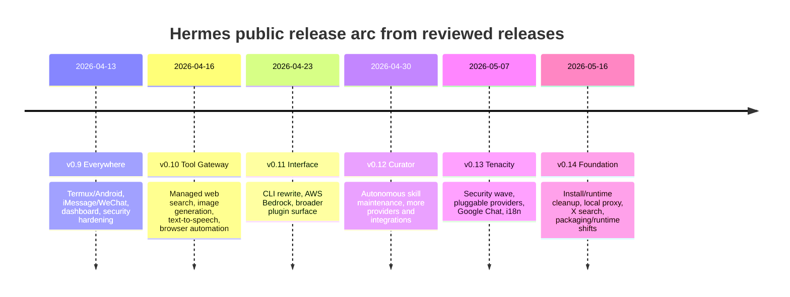
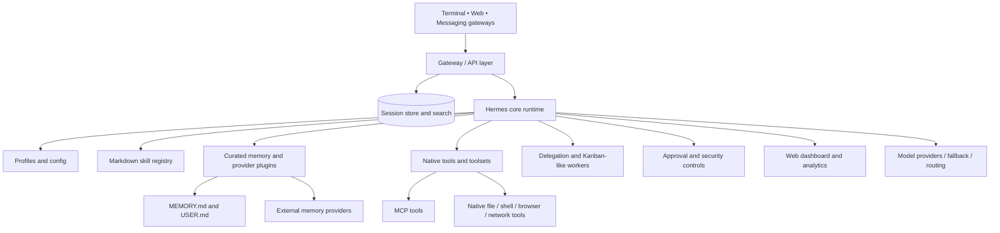
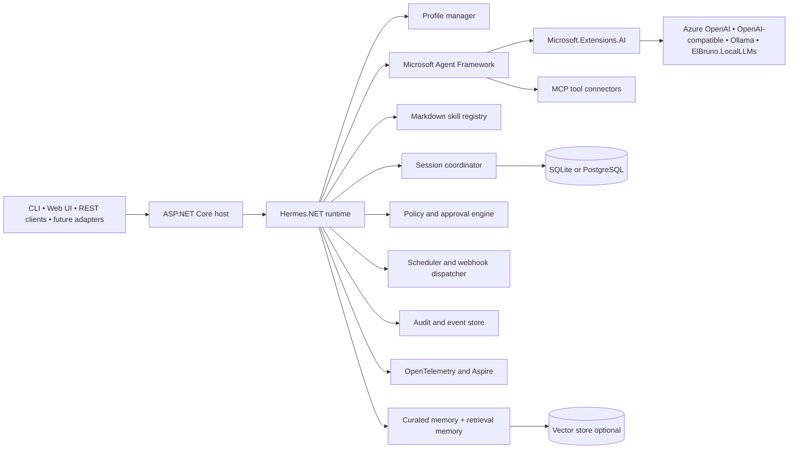
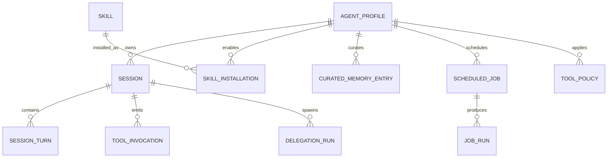
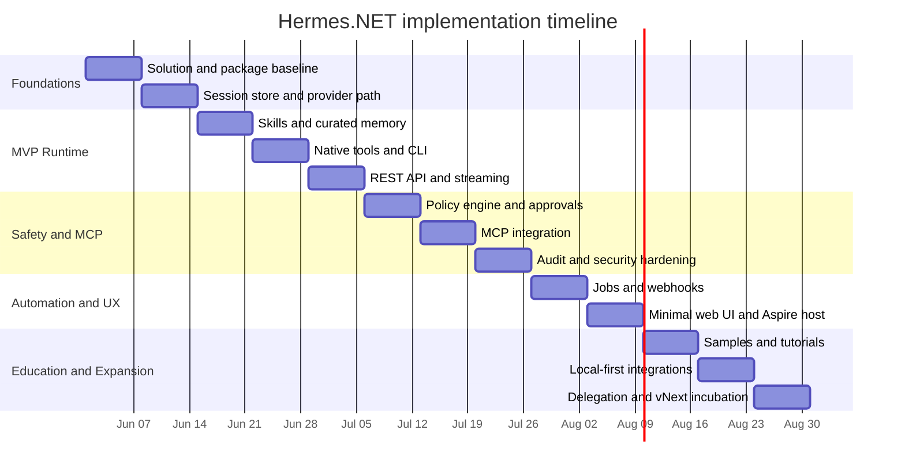

# Hermes.NET Reference PRD and Research Report

*File-ready Markdown document. Save as `docs/PRD-Hermes.NET.md` or `README.md` in a GitHub repository; all Mermaid diagrams below use GitHub-compatible syntax. This document is written for direct use with GitHub Copilot and assumes the review date is 2026-05-22 in America/Toronto. Where an official source does not specify a detail, it is marked **unspecified** rather than inferred as fact.*[^1][^2][^17][^34]

## Executive Summary

Hermes Agent is an open-source AI agent runtime from Nous Research with a clear product orientation: it is not just a tool-calling SDK or a thin provider wrapper, but a broad runtime that combines profiles, sessions, markdown-driven skills, curated and pluggable memory, MCP integration, durable collaboration patterns, automation entry points, messaging adapters, and an operator-facing dashboard.[^1][^2][^3][^4] The official public surfaces that matter most for a .NET reference implementation are the main `NousResearch/hermes-agent` repository, the live Hermes documentation site, the GitHub Releases feed, and the separate `hermes-agent-self-evolution` repository, which appears adjacent to rather than part of the core runtime.[^1][^2][^13][^35]

For a .NET 10 implementation, the strongest architectural conclusion is that Hermes should be treated as a **product layer** built on top of Microsoft’s newer agent and AI building blocks, not as a one-to-one library port. Microsoft Agent Framework already covers many of the core runtime primitives Hermes needs—agents, sessions, workflows, tools, MCP, memory/context providers, hosting, and OpenTelemetry-based observability—while Microsoft.Extensions.AI provides the provider-agnostic `IChatClient` abstraction, tool-calling primitives, caching, dependency injection integration, and telemetry hooks.[^17][^18][^19][^20][^21] The Hermes-specific value to recreate in .NET is therefore concentrated in the higher-level experience: markdown skills, curated `MEMORY.md` and `USER.md`, tool policy and approvals, profile-centric workflows, educational operator UX, and a durable but simple automation/collaboration model.[^3][^5][^6][^7][^9]

The most suitable open-source strategy is a **Hermes-inspired reference runtime** named **Hermes.NET**, implemented in .NET 10, with an intentionally small and clear MVP: profiles, sessions, markdown skills, curated memory, native function tools, MCP tools, a policy/approval layer, REST plus CLI interfaces, and first-class observability. Messaging breadth, full dashboard parity, and durable Kanban-style collaboration should be staged later. This sequencing aligns with the strongest overlap between Hermes’s documented capabilities and Microsoft’s official abstractions, while avoiding premature attempts to clone the full Python product surface.[^3][^4][^5][^17][^19]

The table below is the requested initial comparison snapshot and should guide both scope and package selection.[^3][^4][^17][^19][^21][^30]

| Dimension | Hermes Agent | Microsoft Agent Framework | Microsoft.Extensions.AI | El Bruno Local packages | Implication for Hermes.NET |
|---|---|---|---|---|---|
| Architectural level | Product/runtime for “agents that do things” | Agent runtime/framework | AI abstraction layer | Local-first adjunct packages aligned to Microsoft abstractions | Treat Hermes.NET as a product layer over MAF + MEAI |
| Model/provider abstraction | Strong, provider-rich, routing/fallback oriented | Provider model for agents and remote agents | `IChatClient`, embeddings, function invocation | Local LLM and local embeddings options | Use MEAI for model plumbing; keep provider choice swappable |
| Sessions and persistence | Strong, SQLite-backed sessions/search documented | First-class sessions and persistence concepts | Not a full session framework by itself | Optional helpers only | Use MAF + app persistence layer |
| Tools | Broad built-in registry and toolsets | Function tools, approval, code/file/web tools | Provider-agnostic function calling | MCP router helpers and local-first utilities | Build a unified tool registry on MAF/MEAI |
| MCP | First-class | First-class local and hosted MCP support | Indirect via tooling layer | Helpful adjuncts | Reuse MAF MCP where possible |
| Skills | First-class markdown skill system | No direct equivalent | No direct equivalent | No direct equivalent | Build custom skill layer in Hermes.NET |
| Memory | Curated files plus external memory plugins | Context providers and vector-memory patterns | Works with vector ecosystem, not full memory semantics alone | Local embeddings and memory helpers | Recreate Hermes curated memory explicitly |
| Durable collaboration | Kanban and delegation patterns | Workflows and multi-agent orchestration, but not Hermes Kanban out of box | None | None direct | Defer durable collaboration beyond MVP |
| Messaging channels | Very broad official channel list | Not the product focus | Not applicable | None direct | Treat adapters as later-phase add-ons |
| Observability | Dashboard logs/analytics; standardized tracing surface not prominent in reviewed docs | OpenTelemetry-native | OTel hooks in builder/pipeline | Compatible | Improve materially on Hermes here |
| Local-first developer story | Strong emphasis in runtime/docs | Supported depending on provider/tooling | Strong abstraction story | Especially strong | Make local-first demos a first-class design goal |

## Comparison Snapshot

Hermes’s strongest differentiated features are not the generic “chat + tool calling” basics that many frameworks now share. They are the integrated surfaces around **skills, curated memory, approval-driven action, profile-centric automation, and operator experience**. Microsoft’s stack is strongest at the *substrate* level; Hermes is strongest at the *product* level. That distinction is the central design premise of this PRD.[^3][^4][^17][^21]

A second mapping is equally important. Hermes’s official documentation gives a clearer and more mature story for safety than for standards-based observability. Microsoft Agent Framework and Microsoft.Extensions.AI give a clearer and more mature story for telemetry and standardized hosting than for Hermes-style markdown skills or broad messaging adapters. Hermes.NET should therefore borrow safety ideas from Hermes and observability/hosting patterns from Microsoft, instead of trying to force either ecosystem into the other’s weakest areas.[^6][^11][^19][^20][^21]

## Hermes Ecosystem Research

### Official repositories, docs, community, and changelog surfaces

The official Hermes surfaces reviewed for this document are the main repository, the Hermes documentation site, GitHub Releases, the contributor and security documents in the main repository, and the separate `hermes-agent-self-evolution` repository. The documentation site is the canonical source for user and developer guidance. The self-evolution repository is explicitly adjacent and should not be confused with the core runtime unless a future official source states otherwise.[^1][^2][^13][^15][^16][^35]

| Official surface | Role | Notes for Hermes.NET |
|---|---|---|
| `NousResearch/hermes-agent` | Core runtime repository | Canonical codebase and issue tracker |
| Hermes docs site | Canonical docs for features, guides, security, architecture | Most important design source |
| GitHub Releases | Primary public changelog surface in reviewed sources | Use as authoritative release timeline |
| Contributor guide | Maintainer expectations and contribution priorities | Useful model, but governance remains maintainer-led |
| Security policy | Vulnerability disclosure and security stance | Good baseline for OSS project policy |
| `hermes-agent-self-evolution` | Adjacent optimization/evolution repo | Treat as an ecosystem component, not core scope |
| Community surfaces | Discord, user stories, issues, Skills Hub references | Good examples of community demand and use cases |

Hermes’s official community posture appears active but not fully formalized. The docs have a “User Stories & Use Cases” section populated from public community examples, and the contributor guide routes people through issues and pull requests. At the same time, in the reviewed sources the Discussions surface was ambiguous: the docs point people there, but a 2026 issue reports that the public Discussions link did not exist. A formal governance charter, RFC process, or stable public design-review mechanism was **unspecified** in the reviewed official sources.[^14][^15]

The public change-log story is similarly good but fragmented. Hermes emits frequent and informative GitHub Releases, but in the reviewed surfaces a single canonical `CHANGELOG.md` was **unspecified** as the primary changelog surface. For Hermes.NET, the release notes model is good, but a consolidated changelog should still be added for contributor ergonomics.[^13]

### Release trajectory and what it signals

The release history reviewed in GitHub Releases shows a rapid public expansion through April and May 2026. The sequence from v0.9 through v0.14 emphasizes platform reach, Tool Gateway integrations, CLI and plugin changes, Curator-centric skill maintenance, security hardening, more providers, local proxy support, and packaging/runtime cleanup. That trajectory suggests Hermes is still maturing in parallel across product features and operational foundations.[^13]



From a .NET planning perspective, the release arc argues against chasing full parity too early. The features with the most stable conceptual fit for a first open-source .NET reference are the ones that also have the clearest architectural separation in the docs: profiles, sessions, tools, curated memory, skills, safety controls, and automation entry points.[^3][^4][^5][^6][^13]

### Supported scenarios and official example use cases

Hermes’s own docs and guides show a broad range of supported scenarios. The most relevant official examples for a .NET reference are the GitHub PR Review Agent guide, the Python library embedding guide, the broad messaging gateway documentation, the Kanban/durable collaboration feature, and the tools/skills/memory/security documentation that support general-purpose “agents that do things.”[^7][^8][^9][^10][^12]

| Scenario | Official evidence | Fit for Hermes.NET MVP |
|---|---|---|
| Terminal-first general assistant | Core docs and feature pages | Yes |
| GitHub PR review agent | Dedicated official guide | Yes |
| Tool-rich research/automation assistant | Features, tools reference, security docs | Yes |
| Messaging-channel assistant | Messaging gateway docs | Later phase |
| Durable multi-profile collaboration | Kanban feature docs | Later phase |
| Embedded library usage | Python library guide as reference pattern | Yes, but in .NET form |
| Autonomous skill maintenance/evolution | Curator release notes and self-evolution repo | Later phase or adjacent repo |
| Voice and media workflows | Tool Gateway releases, TTS mentions | Later phase |

## Feature Inventory and Architecture

### Full feature inventory

The official Hermes documents and release notes describe a broad feature surface. Some areas are precisely specified in the docs; others are obvious in behavior but less formal as stable APIs. The table below distinguishes the two and explicitly marks gaps as **unspecified** where needed.[^3][^4][^5][^6][^7][^8][^9][^10][^11][^13]

| Area | Hermes status from reviewed official sources | Specificity in official docs | Hermes.NET interpretation |
|---|---|---|---|
| Provider abstraction | Strong multi-provider runtime with routing/fallback patterns | Partly specified | Use MEAI `IChatClient` and provider adapters |
| Agent types | Practical runtime roles are visible, but formal stable taxonomy is **unspecified** | Partly specified | Model roles as profiles, delegated runs, jobs, and worker processes |
| Sessions and persistence | Strong; SQLite-backed sessions and search are documented | Specified | Recreate with SQLite-first, PostgreSQL optional |
| Tools and toolsets | Strong; large built-in registry/toolsets documented | Specified | Build unified tool registry with categories and policy |
| MCP integration | Strong; local and remote MCP usage documented | Specified | Reuse MAF MCP support |
| Skills | Strong; markdown-first skill model is a signature feature | Specified | Recreate directly as first-class feature |
| Memory, curated | Strong; `MEMORY.md` and `USER.md` with memory tool | Specified | Recreate directly |
| Memory, external providers | Strong; plugin providers selectable one at a time | Specified | Use vector/context abstraction with pluggable providers |
| Planning | Planning behavior exists, but a standalone “planner subsystem” is **unspecified** | Partly specified | Add an explicit plan artifact to improve determinism |
| Delegation | Strong; `delegate_task` and related workflows are documented | Partly specified | Add child-run orchestration |
| Durable collaboration | Strong via Kanban | Specified | Defer until after MVP |
| Automation | Cron/webhook-like entry points and operational flows visible | Partly specified | Add scheduler + webhooks in second phase |
| Messaging adapters | Very broad, around twenty platforms listed in docs | Specified | Later phase |
| Web dashboard | Present with logs/analytics/session/operator UX | Specified | Start with minimal operator web UI |
| Safety/security | Strong and detailed | Specified | Borrow directly; improve with .NET middleware |
| Observability/telemetry | Logs and analytics documented; standardized OTel-style tracing is **unspecified** in reviewed docs | Partly specified | Make OTel first-class from day one |
| Licensing | MIT | Specified | Keep MIT |
| Governance | Maintainer-led contribution flow; formal governance charter **unspecified** | Partly specified | Add more explicit OSS governance in Hermes.NET |

The most important design nuance is memory. Hermes separates **curated, always-available operator memory** from **pluggable external memory providers**. In practice, this means that even without a vector store, Hermes still has a durable memory concept via `MEMORY.md` and `USER.md`, both of which are injected into the agent’s context and managed through a memory tool. That is a valuable pattern to preserve in .NET because it keeps the educational story strong even when no retrieval infrastructure is present.[^5]

The next crucial nuance is orchestration. Hermes has at least two distinct patterns in the reviewed sources: a lighter-weight delegation flow for subtask fan-out and a more durable Kanban model for resumable, cross-profile, long-running collaboration. They solve different problems and should not be collapsed into one abstraction in Hermes.NET.[^9]

### Reconstructed conceptual architecture from official docs

No single official architecture image suitable for stable hotlinking was identified in the reviewed public docs, so the diagram below reconstructs the documented component relationships in Mermaid form.[^4]



### Reference implementation lessons from official Hermes examples

Hermes’s official guides are more useful as *reference behaviors* than as direct implementation templates. The PR review guide shows how a focused, task-bounded agent should combine repository context, tools, and formatting expectations. The messaging gateway shows that transport adapters should be separated from core policy and state. The Python library guide shows that a library-first runtime still benefits from the same profile/session abstractions the CLI uses. The Kanban feature shows that durable multi-agent collaboration is different enough from ad hoc delegation that it deserves a separate subsystem.[^9][^10][^12]

For Hermes.NET, the practical conclusion is to implement the runtime in layers. The core runtime should not know or care whether a request came from a CLI, a REST endpoint, or a future adapter. Skills, memory, and policy must live *below* transport. Durable jobs and delegation should emit artifacts into the same telemetry and audit pipeline as interactive sessions.[^4][^9][^12]

## Compatibility Mapping and Package Strategy

### Mapping Hermes to Microsoft Agent Framework and Microsoft.Extensions.AI

Microsoft Agent Framework is the strongest official .NET substrate for a Hermes-inspired runtime. Microsoft positions it as the successor path for building AI agents with simple abstractions plus richer enterprise/runtime features. The official docs cover sessions, tools, workflows, providers, hosting, and observability, which aligns closely with the core building blocks Hermes.NET needs.[^17][^18][^19][^20]

Microsoft.Extensions.AI is the best foundation one layer lower. It gives a provider-independent AI abstraction model centered on `IChatClient`, `IEmbeddingGenerator`, streaming, function calling, DI integration, and builder-based composition with logging, caching, and telemetry hooks. That is precisely the right place to solve model plumbing and function-call interoperability while keeping the Hermes-specific runtime above it.[^21][^25][^26][^27]

The gap is not in low-level capability but in product semantics. Microsoft’s official packages do not ship a Hermes-like markdown skill system, Hermes-style curated memory files, or Hermes’s broad messaging and Kanban product surfaces. Those must be designed as application-level abstractions in Hermes.NET.[^5][^7][^9][^17][^21]

| Hermes concern | Best Microsoft/El Bruno mapping | Gap assessment | Recommendation |
|---|---|---|---|
| Provider independence | MEAI `IChatClient` | Low gap | Use MEAI directly |
| Agent host/runtime | Microsoft Agent Framework | Low gap | Use for sessions, orchestration, hosting |
| Function tools | MAF tools + MEAI function invocation | Low gap | Standardize all native tools on this path |
| MCP servers/tools | MAF MCP support | Low gap | Avoid custom MCP plumbing unless necessary |
| Curated memory files | Custom app layer | High gap | Implement directly in Hermes.NET |
| External memory providers | MAF context providers + VectorData | Medium gap | Add pluggable retrieval adapter layer |
| Markdown skills | Custom app layer | High gap | Implement as first-class feature |
| Delegation | MAF orchestration/workflows + custom child-run store | Medium gap | Add explicit child execution model |
| Durable Kanban | Custom app layer | High gap | Defer beyond MVP |
| Web dashboard/operator UX | ASP.NET Core + Aspire + OTel + custom UI | Medium gap | Build minimal UI first |
| Messaging breadth | Custom adapters | High gap | Defer |
| Observability | MAF + MEAI + OTel | Low gap | Make this stronger than Hermes default |

### El Bruno Local package fit

El Bruno’s packages are especially valuable for the educational and local-first goals of Hermes.NET because they align with Microsoft’s abstractions rather than bypassing them. The reviewed NuGet profile and packages show local LLM support through MEAI, local embeddings that integrate with `Microsoft.Extensions.VectorData`, MCP-related helpers, and a real-time package that explicitly references both Microsoft.Extensions.AI and Microsoft Agent Framework in its package positioning.[^30][^31][^32][^33]

That makes El Bruno’s ecosystem a good fit for **optional accelerators**, not core dependencies. Hermes.NET should work perfectly without them, but local demos, offline tutorials, and “fewest cloud prerequisites” onboarding paths should use them where appropriate.[^30][^31][^32]

### Package recommendations for .NET 10

All version numbers below are the latest visible in the reviewed package feeds on 2026-05-22. If feeds move after that date, pin centrally and treat updates as a separate dependency-management task rather than an implicit repo-wide change.[^22][^23][^24][^25][^26][^27][^28][^29][^31][^32][^33][^34]

| Role | Package | Version visible in reviewed sources | Recommendation |
|---|---|---:|---|
| Agent runtime | `Microsoft.Agents.AI` | 1.6.1 | Required |
| ASP.NET host | `Microsoft.Agents.Hosting.AspNetCore` | 1.0.1 | Required |
| Workflows | `Microsoft.Agents.AI.Workflows` | 1.0.0-rc1 | Optional after MVP |
| AI abstractions | `Microsoft.Extensions.AI` | 10.6.0 | Required |
| OpenAI-compatible chat | `Microsoft.Extensions.AI.OpenAI` | 10.6.0 | Required for first provider path |
| Vector abstractions | `Microsoft.Extensions.VectorData.Abstractions` | 10.6.0 | Optional in MVP; required when retrieval memory lands |
| Local orchestration | `Aspire.Hosting.AppHost` | 13.3.3 | Strongly recommended |
| Telemetry host integration | `OpenTelemetry.Extensions.Hosting` | 1.15.3 | Required |
| Local LLM option | `ElBruno.LocalLLMs` | 0.16.0 | Optional but strongly recommended |
| Local embeddings option | `ElBruno.LocalEmbeddings.VectorData` | 1.4.6 | Optional but strongly recommended |
| Structured memory option | `MemPalace.Core` | 0.15.2 | Optional experimental path |

A small number of additional third-party packages are reasonable evaluation candidates, but they were not validated against primary sources in this research pass and are therefore marked **evaluation suggestions only**: a scheduler package for cron semantics, a snapshot/transcript testing package, a container-based integration test harness, and structured log sinks. If adopted, they should be isolated behind optional infrastructure layers rather than hardwired into the core runtime.

## Product Requirements Document

### Product purpose, assumptions, target users, and success metrics

**Product name.** Hermes.NET

**Product purpose.** Hermes.NET is an open-source reference implementation, for .NET 10, of the most architecturally important Hermes ideas: profile-centric agents, durable sessions, markdown skills, curated memory, native and MCP tools, safe action with approvals, automation entry points, and educational observability. It is explicitly **not** a promise of one-to-one parity with the Python runtime.[^3][^4][^5][^17][^21]

**Assumptions.**

| Assumption | Rationale |
|---|---|
| .NET 10 is the target runtime | User requirement; official .NET 10 distribution page reviewed |
| Microsoft Agent Framework and MEAI are preferred foundations | They provide the strongest official abstractions for runtime and provider layers |
| Hermes is treated as an opinionated product layer | Its differentiation lies above raw tool calling |
| Versions are pinned centrally | Package feeds change faster than PRDs |
| Items not specified in official docs remain unspecified | Prevents accidental invention of “facts” |
| MVP favors simplicity and education over breadth | Largest value for OSS adoption and Copilot utility |

**Target users.**

| User type | Primary need |
|---|---|
| .NET developers | A readable reference runtime for agentic applications |
| Educators and advocates | A local-first demo project with explainable architecture |
| OSS contributors | A well-structured codebase with clear extension points |
| Internal engineering teams | A starting point for safe, tool-rich agents on Microsoft’s stack |

**Success metrics.**

| Metric | Target |
|---|---:|
| First successful local chat after cloning repo | under 10 minutes |
| Add a native tool and see it invoked | under 30 minutes |
| Add an MCP server and test it | under 30 minutes |
| Author and enable a markdown skill | under 20 minutes |
| End-to-end sample applications in repo | at least 4 |
| Core runtime automated test coverage | at least 80% |
| OTel trace coverage on critical paths | at least 90% |
| Documentation completeness | onboarding, architecture, skills, memory, tools, security, deployment, contribution guide all present |

### Functional requirements

The MVP feature set should be intentionally narrow and explicit. Profiles, sessions, skills, curated memory, tools, policy, telemetry, REST hosting, and CLI support belong in v1. Broad messaging adapters, durable Kanban parity, and voice should not.[^5][^7][^9][^17][^20]

| Area | Functional requirement |
|---|---|
| Profiles | Support multiple named profiles with isolated config, model defaults, enabled skills, and memory scope |
| Sessions | Persist sessions, turns, summaries, tool calls, and searchable metadata |
| Chat loop | Support streaming and non-streaming replies |
| Skills | Load markdown skills from disk, validate metadata, resolve by trigger/name, and enable per profile |
| Curated memory | Implement `MEMORY.md` and `USER.md` per profile with read/update controls |
| Retrieval memory | Optional pluggable long-term recall using vector/context providers |
| Tools | Support native function tools, MCP tools, and a safe shell/file/network set with policy metadata |
| Planning | Create explicit plan artifacts before multi-step execution when requested by profile or skill |
| Delegation | Spawn child runs for bounded subtasks and track parent-child lineage |
| Automation | Support scheduled jobs and inbound webhooks |
| API access | Expose REST + SSE/WebSocket event streaming |
| CLI | Provide a first-class terminal interface |
| Web UI | Provide a minimal operator UI for sessions, jobs, skills, and traces |
| Telemetry | Emit logs, metrics, traces, and structured audit events |
| Security | Enforce authentication, approval policies, URL policy, secret redaction, and safe execution defaults |

### Non-functional requirements

| Area | Non-functional requirement |
|---|---|
| Readability | A competent .NET developer should understand the runtime architecture within a few hours |
| Cross-platform | Linux, macOS, and Windows supported |
| Local-first operation | Full demo path must work without cloud dependence |
| Extensibility | New providers, tools, skills, and storage adapters must be pluggable |
| Reliability | Background jobs and sessions survive restarts |
| Observability | End-to-end OTel from day one |
| Privacy by default | Sensitive content not logged unless explicitly enabled |
| Performance | Core runtime overhead should be small relative to model latency |
| Governance | Clear CODEOWNERS, contribution guide, and release process |

### Reference architecture



This design keeps the Microsoft packages as the substrate while placing Hermes-specific concepts above them, where they belong architecturally.[^17][^19][^21]

### API surface and SDK interfaces

**HTTP API surface.**

| Method and route | Purpose |
|---|---|
| `POST /api/profiles` | Create/update a profile |
| `GET /api/profiles` | List profiles |
| `POST /api/sessions` | Create a session under a profile |
| `GET /api/sessions/{id}` | Retrieve metadata and summary |
| `POST /api/sessions/{id}/messages` | Submit a user message |
| `GET /api/sessions/{id}/events` | Stream tokens, tool events, and status |
| `GET /api/sessions/search?q=` | Search summaries and metadata |
| `GET /api/skills` | List installed and available skills |
| `POST /api/skills/install` | Install or register a skill |
| `GET /api/tools` | List tool inventory visible to a profile |
| `POST /api/jobs` | Create scheduled job |
| `GET /api/jobs` | List jobs and last runs |
| `POST /api/webhooks/{name}` | Webhook-triggered entry point |
| `GET /healthz` | Liveness |
| `GET /readyz` | Readiness |
| `GET /metrics` | Metrics endpoint |

**SDK/core interfaces.**

```csharp
public interface IHermesRuntime
{
    Task<SessionHandle> CreateSessionAsync(
        string profileId,
        CancellationToken cancellationToken = default);

    IAsyncEnumerable<RuntimeEvent> SendAsync(
        string sessionId,
        UserMessage input,
        CancellationToken cancellationToken = default);
}

public interface ISkillRegistry
{
    Task<IReadOnlyList<SkillManifest>> ListAsync(
        string profileId,
        CancellationToken cancellationToken = default);

    Task<SkillManifest?> ResolveAsync(
        string profileId,
        string triggerOrName,
        CancellationToken cancellationToken = default);
}

public interface IMemoryCoordinator
{
    Task<CuratedMemorySnapshot> GetCuratedSnapshotAsync(
        string profileId,
        CancellationToken cancellationToken = default);

    Task<IReadOnlyList<MemoryRecall>> RecallAsync(
        string profileId,
        string query,
        CancellationToken cancellationToken = default);

    Task PersistTurnAsync(
        string profileId,
        SessionTurn turn,
        CancellationToken cancellationToken = default);
}

public interface IPolicyEngine
{
    Task<PolicyDecision> EvaluateToolCallAsync(
        ToolInvocation invocation,
        CancellationToken cancellationToken = default);
}
```

These interfaces deliberately separate runtime orchestration, skill resolution, memory coordination, and policy evaluation because those are the Hermes-like seams that most deserve explicit .NET abstractions.[^4][^5][^6][^7]

### Data model and storage design



**Core entities.**

| Entity | Key fields |
|---|---|
| `AgentProfile` | `Id`, `Name`, `Description`, `DefaultModel`, `EnabledSkillSet`, `ToolPolicySet`, `WorkspacePath` |
| `Session` | `Id`, `ProfileId`, `Channel`, `Status`, `Summary`, `CreatedUtc`, `UpdatedUtc`, `TraceId` |
| `SessionTurn` | `Id`, `SessionId`, `Role`, `Content`, `TokenUsage`, `LatencyMs`, `CreatedUtc` |
| `ToolInvocation` | `Id`, `SessionId`, `ToolName`, `ArgsJson`, `ResultJson`, `Category`, `ApprovalState`, `DurationMs` |
| `Skill` | `Id`, `Name`, `Version`, `Source`, `MarkdownBody`, `MetadataJson` |
| `SkillInstallation` | `Id`, `ProfileId`, `SkillId`, `Enabled`, `Priority` |
| `CuratedMemoryEntry` | `Id`, `ProfileId`, `Kind`, `Content`, `Priority`, `UpdatedUtc` |
| `ScheduledJob` | `Id`, `ProfileId`, `Cron`, `Prompt`, `AttachedSkills`, `Enabled` |
| `JobRun` | `Id`, `JobId`, `StartedUtc`, `CompletedUtc`, `Status`, `Summary` |
| `DelegationRun` | `Id`, `ParentSessionId`, `ChildSessionId`, `Status`, `ResultSummary` |
| `ToolPolicy` | `Id`, `ProfileId`, `ToolPattern`, `AccessLevel`, `RequireApproval`, `AllowedDomains` |

**Local file/layout convention.**

```text
/workspace
  /profiles/default
    profile.json
    MEMORY.md
    USER.md
    /skills
      pr-review.md
      research.md
  /data
    hermesnet.db
  /artifacts
    /sessions
    /jobs
  /logs
```

SQLite should be the default operational store because Hermes itself uses SQLite-centric patterns and because a file-local operational story is ideal for education and Copilot-assisted exploration. PostgreSQL should be an optional later adapter for cloud deployments.[^4]

### Skill format and tool integration patterns

A markdown-first skill format is one of the most important Hermes ideas to preserve because it keeps agent behavior inspectable, composable, and friendly to both humans and LLM-assisted editing.[^7]

**Recommended skill format.**

```markdown
---
name: pr-review
description: Review a diff and provide actionable feedback.
triggers:
  - review pr
  - inspect pull request
tools:
  - git.diff
  - github.comment
  - file.read
memory:
  curated: read
  retrieval: optional
safety:
  approval_required: false
---

# Role

You are a careful code reviewer.

# Workflow

1. Summarize the change.
2. Identify correctness, security, reliability, and maintainability risks.
3. Suggest concrete edits.
4. Produce a concise final review.
```

**Tool integration patterns.**

| Pattern | When to use | Implementation path | Approval default |
|---|---|---|---|
| Native function tool | Local deterministic logic | `AIFunction` + DI service | No for read-only |
| Native shell tool | Bounded process execution | Wrapped executor + sandbox + audit | Yes |
| MCP local tool | Existing local MCP server | MAF MCP connector | Depends on tool category |
| MCP remote tool | Hosted/external capability | MAF hosted MCP path | Usually yes unless allowlisted |
| Webhook tool | Trigger external action | Strongly typed HTTP client + policy | Yes for mutating actions |
| Retrieval tool | Query vector/context store | Memory adapter | No for read-only |

**Illustrative registration pseudocode.**

```csharp
builder.Services.AddSingleton<IPolicyEngine, DefaultPolicyEngine>();
builder.Services.AddSingleton<ISkillRegistry, MarkdownSkillRegistry>();
builder.Services.AddSingleton<IMemoryCoordinator, DefaultMemoryCoordinator>();

builder.Services.AddChatClient(sp =>
{
    // Provider-specific IChatClient registration via Microsoft.Extensions.AI
    return CreateChatClientFromConfiguration(sp);
});

builder.Services.AddSingleton<AIFunction>(sp =>
    AIFunctionFactory.Create(
        nameof(ReadFileAsync),
        async (string path, CancellationToken ct) =>
        {
            var policy = await sp.GetRequiredService<IPolicyEngine>()
                .EvaluateToolCallAsync(ToolInvocation.ReadOnly("file.read", new { path }), ct);

            if (!policy.Allowed) throw new UnauthorizedAccessException(policy.Reason);
            return await File.ReadAllTextAsync(path, ct);
        }));
```

### Security, privacy, and deployment model

Hermes’s security documentation is one of its strongest official assets. The reviewed docs describe layered controls including authorization, dangerous-command approval, container isolation, credential filtering for MCP, prompt-injection scanning for context files, SSRF/URL restrictions, and supply-chain advisory checks. Hermes.NET should preserve those ideas while implementing them in idiomatic .NET middleware and hosting constructs.[^6]

**Security policy categories.**

| Category | Default behavior |
|---|---|
| Read-only local tools | Allowed by default, audited |
| Write/mutation tools | Require explicit approval unless trusted profile policy says otherwise |
| Network tools | Restricted by domain allowlist and SSRF checks |
| Shell/exec tools | Disabled by default outside sandbox; approval always required |
| Secret-bearing tools | Secrets never exposed to model context unless intentionally scoped |
| Imported context/skills | Scan for prompt-injection patterns before enablement |

**Privacy defaults.**

| Concern | Default |
|---|---|
| Prompt and response content in logs | Off |
| Derived metrics and timings | On |
| Trace correlation IDs | On |
| Tool arguments/results | Redacted by default for sensitive categories |
| Persistent storage of raw conversation | Configurable per profile |
| Provider-specific retention/export controls | **Unspecified** by this PRD unless documented for the selected provider |

**Deployment modes.**

| Mode | Description | Priority |
|---|---|---|
| Local developer mode | Aspire + SQLite + local provider or OpenAI-compatible provider | Highest |
| Single-node container mode | Docker Compose with API, UI, DB, telemetry collector | High |
| Cloud-native mode | Azure Container Apps or AKS with PostgreSQL/vector backends | Later |

### Telemetry, testing, CI/CD, and Copilot-ready repo shape

Hermes’s docs show dashboard logs and analytics, but not a standardized observability stack comparable to MAF’s OpenTelemetry story. Hermes.NET should therefore make traces, metrics, and structured logs mandatory in the architecture rather than optional plumbing.[^11][^20]

**Telemetry plan.**

| Signal | Emit for |
|---|---|
| Traces | session start/end, message build, model invocation, tool invocation, MCP call, memory recall, memory persist, scheduled job, webhook entry, delegation |
| Metrics | tokens, latency, errors, tool call counts, approval denials, active sessions, job queue depth |
| Structured logs | startup, policy decisions, adapter registration, skill loading, job outcome |
| Audit events | tool approvals, policy denials, profile changes, secret access, configuration changes |

**Testing strategy.**

| Layer | Coverage |
|---|---|
| Unit tests | skill parsing, policy rules, memory coordinator, tool metadata |
| Contract tests | REST payloads, SSE event stream, MCP registration |
| Integration tests | SQLite store, vector adapter, selected provider path |
| Transcript tests | deterministic agent transcripts under fixed prompts |
| Security tests | SSRF blocking, command approval, injection scanning, redaction |
| End-to-end tests | Console agent, Web API agent, MCP demo, local-offline sample |

**CI/CD requirements.**

| Stage | Actions |
|---|---|
| Validation | restore, build, lint/format, tests |
| Security | dependency scan, container scan, secret scan |
| Packaging | publish container images and NuGet packages where applicable |
| Documentation | link check, Mermaid render validation where possible |
| Release | release notes, changelog, signed artifacts if feasible |

**Copilot-ready repository layout.**

```text
/.github
  /workflows
  /ISSUE_TEMPLATE
  CODEOWNERS
  copilot-instructions.md
/docs
  PRD-Hermes.NET.md
  architecture.md
  security.md
  skills.md
/src
  HermesNet.Api
  HermesNet.Runtime
  HermesNet.Skills
  HermesNet.Memory
  HermesNet.Tools
  HermesNet.Persistence
  HermesNet.Telemetry
/samples
  ConsoleAgent
  WebApiAgent
  McpToolsDemo
  OfflineLocalAgent
/tests
  HermesNet.UnitTests
  HermesNet.IntegrationTests
```

**Suggested `copilot-instructions.md` seed.**

```markdown
- Prefer Microsoft.Agents.* and Microsoft.Extensions.AI abstractions over custom wrappers.
- Do not bypass IPolicyEngine for write, network, or exec tools.
- Skills are Markdown with YAML front matter; keep them human-readable.
- Curated memory lives in MEMORY.md and USER.md per profile.
- All new endpoints must emit structured telemetry and audit events.
- Treat undocumented Hermes behavior as unspecified; do not invent parity features.
```

### Licensing and contributor guidelines

Hermes Agent uses the MIT License, and its contributor guide states that contributions are made under MIT. Hermes.NET should use MIT as well to keep its dependency, contribution, and sample-story friction low.[^15][^16] The contributor experience should be more explicit than Hermes’s currently reviewed public governance model by adding CODEOWNERS, a release process, issue templates, a lightweight architectural decision record pattern, and a public roadmap. Formal governance beyond that is optional, but expectations around review ownership and release authority should not be left implicit.

## Phased Implementation Plan

The implementation plan below is deliberately conservative. It aims for a **small, teachable reference runtime first**, then adds power. That is the right strategy when the goal is educational clarity plus practical utility, especially because Hermes itself is still evolving rapidly in public releases.[^13]

### Phases, deliverables, milestones, and MVP scope

| Phase | Estimated duration | Deliverables | Milestone |
|---|---:|---|---|
| Foundations | 2 weeks | solution layout, central package management, MEAI provider path, basic MAF host, SQLite session store, OTel baseline | local chat works |
| MVP runtime | 3 weeks | profiles, sessions, markdown skills, curated memory, native tool registry, REST API, CLI | first public MVP |
| Safe tools and MCP | 3 weeks | policy engine, approvals, URL policy, redaction, MCP integration, audit events | safe tooling story |
| Automation and delegation | 3 weeks | scheduled jobs, webhook entry points, child-run orchestration, session lineage | automation story |
| UX and education | 2 weeks | minimal web UI, Aspire local app host, end-to-end samples, walkthrough docs | educational release |
| Incubation | 3 weeks | vector memory, local LLM path, local embeddings, Kanban prototype, optional voice demo | vNext preview |

**MVP scope.**  
The MVP includes profiles, sessions, markdown skills, curated memory, native tools, MCP, policy approvals, REST plus CLI, and telemetry. It excludes broad messaging adapters, full dashboard parity, remote multi-tenant operations, durable Kanban parity, voice, and autonomous self-evolution. Those later features are important, but they are not required to prove the value of a Hermes-inspired .NET architecture.[^5][^7][^9][^13]

### Prioritized backlog and task plan

| Priority | Epic | Why it matters |
|---|---|---|
| P0 | Core runtime and session persistence | Foundation for all UX and automation |
| P0 | Markdown skill system | Signature Hermes concept |
| P0 | Curated memory | Signature Hermes concept |
| P0 | Native tools and policy metadata | Core “do things” capability |
| P0 | OTel telemetry and audit events | Major differentiator over Hermes’s current observability surface |
| P1 | Policy engine and approvals | Safety-critical |
| P1 | MCP integration | Strong parity with Hermes and Microsoft |
| P1 | REST API and CLI | Educational and practical UX |
| P1 | Scheduler and webhooks | Essential automation step |
| P2 | Delegation/child runs | Important orchestration capability |
| P2 | Vector memory adapters | Valuable but not necessary for first release |
| P2 | Local-first integrations | Important for tutorials and demos |
| P3 | Web UI expansion | Nice operator experience |
| P3 | Kanban prototype | Distinctive but expensive |
| P3 | Voice/media workflows | Optional extension area |

| Task | Priority | Recommended owner | Notes |
|---|---|---|---|
| Create solution and package baselines | Highest | maintainer | include central package props |
| Implement profile/session store | Highest | backend | SQLite first |
| Wire default `IChatClient` path | Highest | backend | OpenAI-compatible or local |
| Build markdown skill parser + registry | Highest | backend | YAML front matter |
| Implement curated memory loader/updater | Highest | backend | `MEMORY.md` and `USER.md` |
| Implement tool registry + tool categories | Highest | backend | read-only tools first |
| Add OpenTelemetry across critical flows | Highest | platform | traces + metrics + logs |
| Add policy engine | High | security/backend | approval hooks |
| Add MCP support | High | backend | minimal viable connectors |
| Build CLI | High | developer experience | fastest first-run path |
| Build REST + SSE host | High | backend | minimal API |
| Add job scheduler and webhooks | Medium | backend | BackgroundService initially |
| Build minimal web UI | Medium | full-stack | operator dashboards |
| Add local LLM/embeddings samples | Medium | developer experience | El Bruno path |
| Prototype delegation | Medium | backend | parent-child lineage |
| Finalize docs and tutorials | Highest | docs | must ship with MVP |

### Onboarding docs, samples, tutorials, and outreach

A GitHub Copilot-friendly repo is only as useful as the documents Copilot can ingest. The repository should therefore ship with a small set of high-signal documents from day one: `architecture.md`, `skills.md`, `memory.md`, `tools-and-mcp.md`, `security.md`, `telemetry.md`, `deployment.md`, and `contributing.md`. Those should prioritize concrete examples over abstract prose.[^4][^5][^6][^7]

The four most valuable launch samples are a console assistant, a Web API assistant, an MCP tools demo, and a local-offline assistant using local LLMs and local embeddings. Those samples are enough to demonstrate the architecture without waiting for messaging or web dashboard completeness.[^30][^31][^32]

Community outreach should be practical and code-centric: a reference README, an architectural blog post, a short “Hermes concepts on .NET” tutorial, good-first-issue labels, and recurring release notes. Because Hermes’s official community materials show active user stories but an only partly formalized governance surface, Hermes.NET should make maintainer ownership and contribution flow especially clear.[^14][^15]



## Open Questions and Source Notes

The reviewed official sources are strong enough to support a detailed .NET PRD, but several matters remain genuinely **unspecified** or only partly specified and should stay that way in planning documents until the official Hermes surfaces become clearer. A formal stable agent-class taxonomy is unspecified; the distinction between delegation and Kanban is clear, but a broader public orchestration taxonomy is not. A single canonical `CHANGELOG.md` appears unspecified relative to the active GitHub Releases feed. The public Discussions surface was ambiguous in the reviewed sources. A formal governance charter or RFC process was not evident. Standardized observability beyond dashboard analytics/logs was also not prominent in the reviewed docs.[^11][^13][^14][^15]

Those uncertainties do not weaken the case for Hermes.NET. They strengthen the case for building it as an **analytical reference implementation**—one that ports the strongest ideas with high architectural clarity and improves the areas where Microsoft’s official stack is currently stronger, especially observability, hosting, and standardized tool/runtime composition.[^17][^19][^20][^21]

[^1]: Nous Research, **`hermes-agent` repository**, GitHub, https://github.com/NousResearch/hermes-agent
[^2]: Nous Research, **Hermes Agent documentation**, https://hermes-agent.nousresearch.com/docs/
[^3]: Nous Research, **Hermes features overview**, https://hermes-agent.nousresearch.com/docs/user-guide/features/overview
[^4]: Nous Research, **Developer architecture guide**, https://hermes-agent.nousresearch.com/docs/developer-guide/architecture
[^5]: Nous Research, **Memory feature documentation**, https://hermes-agent.nousresearch.com/docs/user-guide/features/memory
[^6]: Nous Research, **Security documentation**, https://hermes-agent.nousresearch.com/docs/user-guide/security
[^7]: Nous Research, **Skills documentation**, https://hermes-agent.nousresearch.com/docs/user-guide/features/skills
[^8]: Nous Research, **Tools reference**, https://hermes-agent.nousresearch.com/docs/reference/tools-reference
[^9]: Nous Research, **Kanban feature documentation**, https://hermes-agent.nousresearch.com/docs/user-guide/features/kanban
[^10]: Nous Research, **Messaging documentation**, https://hermes-agent.nousresearch.com/docs/user-guide/messaging/
[^11]: Nous Research, **Web dashboard documentation**, https://hermes-agent.nousresearch.com/docs/user-guide/features/web-dashboard
[^12]: Nous Research, **GitHub PR review agent guide**, https://hermes-agent.nousresearch.com/docs/guides/github-pr-review-agent
[^13]: Nous Research, **GitHub Releases for Hermes Agent**, https://github.com/NousResearch/hermes-agent/releases
[^14]: Nous Research, **Issue discussing GitHub Discussions availability**, GitHub issue #7053, https://github.com/NousResearch/hermes-agent/issues/7053
[^15]: Nous Research, **Contributor guide**, https://github.com/NousResearch/hermes-agent/blob/main/website/docs/developer-guide/contributing.md
[^16]: Nous Research, **MIT License for Hermes Agent**, https://github.com/NousResearch/hermes-agent/blob/main/LICENSE
[^17]: Microsoft, **Agent Framework overview**, https://learn.microsoft.com/en-us/agent-framework/overview/
[^18]: Microsoft, **Agent providers**, https://learn.microsoft.com/en-us/agent-framework/agents/providers/
[^19]: Microsoft, **Agent tools documentation**, https://learn.microsoft.com/en-us/agent-framework/agents/tools/
[^20]: Microsoft, **Agent Framework observability documentation**, https://learn.microsoft.com/en-us/agent-framework/agents/observability
[^21]: Microsoft, **Microsoft.Extensions.AI documentation**, https://learn.microsoft.com/en-us/dotnet/ai/microsoft-extensions-ai
[^22]: NuGet, **Microsoft.Agents.AI package**, https://www.nuget.org/packages/Microsoft.Agents.AI/
[^23]: NuGet, **Microsoft.Agents.Hosting.AspNetCore package**, https://www.nuget.org/packages/Microsoft.Agents.Hosting.AspNetCore/
[^24]: NuGet, **Microsoft.Agents.AI.Workflows package**, https://www.nuget.org/packages/Microsoft.Agents.AI.Workflows/
[^25]: NuGet, **Microsoft.Extensions.AI package**, https://www.nuget.org/packages/Microsoft.Extensions.AI/
[^26]: NuGet, **Microsoft.Extensions.AI.OpenAI package**, https://www.nuget.org/packages/Microsoft.Extensions.AI.OpenAI/
[^27]: NuGet, **Microsoft.Extensions.VectorData.Abstractions package**, https://www.nuget.org/packages/Microsoft.Extensions.VectorData.Abstractions/
[^28]: NuGet, **Aspire.Hosting.AppHost package**, https://www.nuget.org/packages/Aspire.Hosting.AppHost/
[^29]: NuGet, **OpenTelemetry.Extensions.Hosting package**, https://www.nuget.org/packages/OpenTelemetry.Extensions.Hosting/
[^30]: NuGet, **El Bruno profile**, https://www.nuget.org/profiles/elbruno
[^31]: NuGet, **ElBruno.LocalLLMs package**, https://www.nuget.org/packages/ElBruno.LocalLLMs/
[^32]: NuGet, **ElBruno.LocalEmbeddings.VectorData package**, https://www.nuget.org/packages/ElBruno.LocalEmbeddings.VectorData/
[^33]: NuGet, **MemPalace.Core package**, https://www.nuget.org/packages/MemPalace.Core/
[^34]: Microsoft, **.NET 10 download page**, https://dotnet.microsoft.com/en-us/download/dotnet/10.0
[^35]: Nous Research, **`hermes-agent-self-evolution` repository**, GitHub, https://github.com/NousResearch/hermes-agent-self-evolution