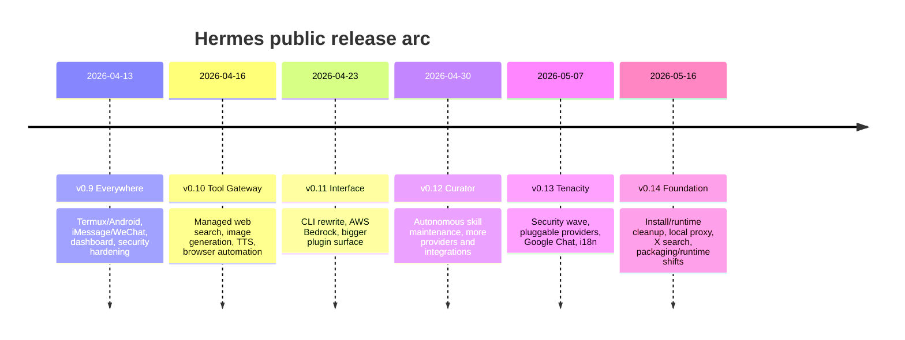
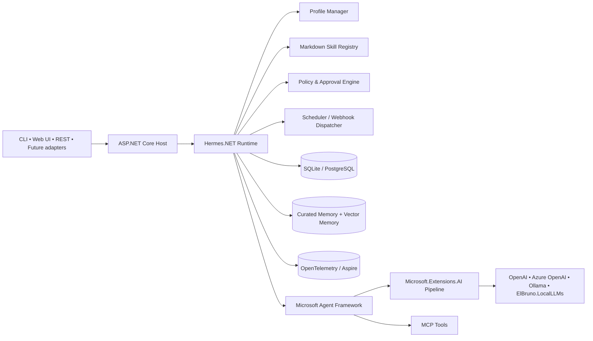
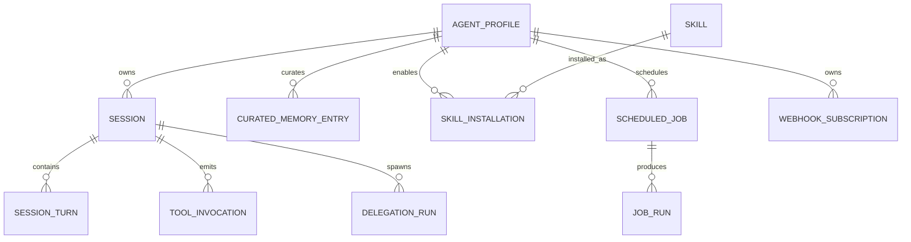
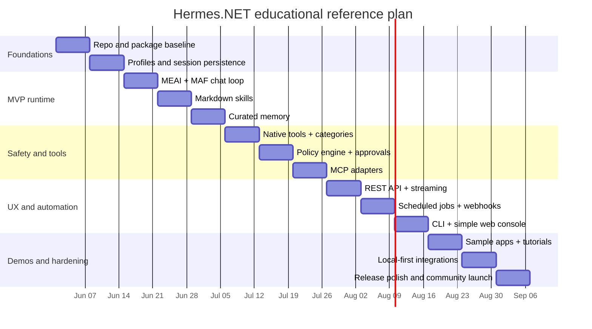

# Hermes Agent Research and .NET Reference PRD

## Executive Summary

Hermes Agent is an open-source, opinionated AI agent runtime from Nous Research rather than a low-level SDK. The official public surfaces I found are the main `NousResearch/hermes-agent` repository, the official docs site, and a separate `NousResearch/hermes-agent-self-evolution` repository that is explicitly described as operating **on** Hermes rather than being part of its core runtime. The official docs describe Hermes as a self-improving, provider-agnostic agent that runs in the terminal, across many messaging platforms, and through cloud or local terminal backends; the core repo and docs also emphasize skills, persistent memory, subagent delegation, MCP integration, automation, and a web dashboard. citeturn6search12turn8search3turn15search0turn17view0turn17view1turn20view0

The most important architectural conclusion for a .NET reference implementation is that Hermes’s differentiators are **not** the generic agent fundamentals alone. Microsoft Agent Framework already gives strong foundations for sessions, tools, MCP, memory/context providers, hosting, workflows, and OpenTelemetry-based observability, while Microsoft.Extensions.AI gives provider-independent `IChatClient` abstractions, automatic function invocation, telemetry hooks, caching, and DI-friendly composition. What Hermes adds on top is an unusually integrated **product/runtime surface**: markdown-first skills, curated memory snapshots, broad messaging adapters, durable Kanban-style collaboration, cron/webhook automation, and operator UX. A faithful .NET reference should therefore treat Hermes as a **layered product architecture** built atop Microsoft’s agent and AI primitives, not as a one-to-one library port. citeturn34view0turn34view1turn34view4turn34view6turn34view7turn34view9turn34view10turn34view11turn34view12

The safest and most educational open-source .NET 10 strategy is to build a **Hermes-inspired reference runtime** with a deliberately small MVP: profiles, sessions, markdown skills, curated short-term memory, native tools, MCP tools, approvals/policies, and one durable orchestration story. Messaging breadth, full dashboard parity, and Hermes’s Kanban-scale collaboration should come later. This prioritization follows both the official Hermes feature set and the official Microsoft stack’s strengths. citeturn21view4turn21view6turn41view0turn32view0turn34view0turn34view4turn34view6

A final caution: several Hermes ecosystem details remain fluid. In the sources reviewed, the docs and README still reference GitHub Discussions, yet an April 2026 issue reported that the Discussions link did not exist; release notes are rich, but a single consolidated `CHANGELOG.md` does not appear to be the canonical change surface; and standardized tracing/telemetry beyond dashboard analytics and logs is not documented as a first-class official capability. Those gaps matter when defining a .NET reference scope and governance model. citeturn25search2turn23view0turn24search0turn32view0turn33search0

## Hermes Today

### Official repositories, docs, community, and changelog surface

In the official sources reviewed, the directly relevant Nous Research assets are the main Hermes Agent repository, the official documentation site, and the separate self-evolution repository. The documentation site is clearly the canonical user/developer reference. The self-evolution repo is separately scoped and described as a standalone optimization pipeline for Hermes skills, prompts, tool descriptions, and code. citeturn6search12turn8search3turn15search0turn15search2

| Official surface | Role in ecosystem | Current reading |
|---|---|---|
| `NousResearch/hermes-agent` | Main runtime, codebase, releases, issues, security policy | Canonical core repository |
| `hermes-agent.nousresearch.com/docs` | User guide, developer guide, integration reference, feature catalog | Canonical documentation |
| `NousResearch/hermes-agent-self-evolution` | Separate optimization/evolution system for Hermes | Related but not core runtime |
| Discord / Skills Hub / Issues | Community and ecosystem surfaces referenced by docs | Active community surfaces |
| GitHub Discussions | Referenced in docs and contributor docs, but public availability was reported broken in April 2026 | Operational status ambiguous in sources reviewed |

The table above is synthesized from official docs, the repository, and official issue/contributor material. citeturn8search3turn15search0turn28view1turn40view2turn25search2

Hermes’s official community signal is strong but somewhat unevenly structured. The docs provide a dedicated “User Stories & Use Cases” page populated from public community posts, and the contributor guide points people to issues and architecture/design discussions. At the same time, the repo discussions surface appears ambiguous in the reviewed sources, and I did not find a formal governance charter or RFC process document beyond the maintainer-led flow implied by issues, pull requests, priorities, and Discord. citeturn8search6turn28view1turn25search1turn25search2turn29search0

Hermes’s change history is rich, but it is organized around GitHub Releases and per-release markdown files such as `RELEASE_v0.14.0.md`, not around a single canonical `CHANGELOG.md`. An issue opened in May 2026 explicitly recommended adding `CHANGELOG.md`, which is useful evidence that the release-note surface is strong but the changelog surface is still fragmented. citeturn23view0turn23view1turn23view2turn23view3turn23view4turn23view5turn24search1turn24search0

### Release trajectory

The official release notes show a very rapid public evolution in April and May 2026: mobile and broader platform reach in v0.9, Tool Gateway in v0.10, interface and provider changes in v0.11, Curator and more integrations in v0.12, security/provider/i18n hardening in v0.13, and “Foundation” install/runtime improvements in v0.14. That cadence suggests Hermes is simultaneously expanding features and hardening operations, which is relevant when deciding what a .NET reference should mimic now versus defer. citeturn23view0turn23view1turn23view2turn23view3turn23view4turn23view5turn24search1turn24search5



This timeline is a synthesis of the official release notes rather than a verbatim project artifact. citeturn23view0turn23view1turn23view2turn23view3turn23view4turn23view5turn24search1turn24search5

### Licensing and governance

Hermes Agent is MIT-licensed. The security policy instructs reporters to use GitHub Security Advisories or `security@nousresearch.com` and says Hermes does not run a bug bounty program. The contributor guide states that contributions are licensed under the MIT License and sets a clear priority order: bug fixes, cross-platform compatibility, security hardening, robustness, new skills, then new tools, then docs. citeturn27search0turn28view2turn28view1turn27search16

Governance appears maintainer-led and pragmatic rather than formally constitutional. The contributor guide spells out dev setup, branch naming, review expectations, and contribution priorities, but in the sources reviewed I did not find a formal governance board, published roadmap authority model, or CODEOWNERS file; notably, an issue from May 2026 flags the absence of `.github/CODEOWNERS`. For a .NET reference project, it would be wise to be more explicit than Hermes currently is on maintainer roles and review gates. citeturn28view1turn29search0

## Hermes Technical Inventory

### Capabilities, agent types, orchestration, integrations, memory, safety, observability

Hermes’s official docs describe a broad, integrated product surface. The runtime includes a large built-in tool registry, skills system, persistent memory, subagent delegation, automation primitives, MCP support, messaging gateways, browser/terminal/file tooling, and a web dashboard. The architecture guide says the central registry holds roughly 70 tools across about 28 toolsets, with SQLite-backed sessions and FTS5 search, a long-running messaging gateway with 20 platform adapters, and plugin points for memory providers and context engines. citeturn21view0turn21view1turn21view2turn20view0

Hermes’s documented “agent types” are really runtime roles rather than a public class taxonomy. The clearest ones are: a main profile agent, delegated subagents created by `delegate_task`, Kanban worker agents that are full OS processes with their own identities, and gateway-served agents exposed across messaging channels. The self-evolution repository is best treated as an adjacent optimization pipeline rather than a live runtime agent type. Official sources do not document a stable, top-level agent-class hierarchy comparable to Microsoft Agent Framework’s `AIAgent` provider taxonomy, so anything more precise would be speculative. citeturn6search10turn21view6turn41view0turn17view1turn15search0

Planning in Hermes is partly explicit and partly skill-driven. The documentation and skills catalog reference planning-oriented skills and structured execution flows, but I did not find a standalone, globally documented planner subsystem analogous to a workflow engine. The practical takeaway is that Hermes combines prompt/skill-mediated planning with tool-enabled execution, delegation, and durable queues rather than exposing “planning” as a single first-class runtime module. citeturn17view6turn21view4turn31search17

Memory is layered. Hermes always has built-in short, curated cross-session memory via `MEMORY.md` and `USER.md`, both injected into the system prompt at session start and managed through a `memory` tool. On top of that, Hermes ships with eight external memory provider plugins; only one can be active at a time, and providers can inject context, prefetch relevant memory, sync conversation turns, and expose provider-specific tools. This is a notable design choice for a .NET port because it cleanly separates **curated operator memory** from **retrieval-rich long-term memory**. citeturn21view3turn30view0

Hermes’s safety story is materially stronger than “just don’t run unsafe prompts.” The official security docs describe seven layers: user authorization, dangerous command approval, container isolation, MCP credential filtering, context-file prompt-injection scanning, URL restrictions/SSRF protection, and supply-chain advisory checks. Command approval can escalate from one-off to session-wide to permanent allowlists; gateway access can be controlled through allowlists or DM pairing with TTLs and rate limits; Docker execution uses hardening flags such as `--cap-drop ALL`, `no-new-privileges`, pid limits, and tmpfs mounts; and Tirith pre-exec scanning adds content-level checks with checksum/cosign verification on install. citeturn21view8turn18view0turn18view1turn18view2turn18view3turn18view6turn40view0turn40view1turn40view2turn40view4

Observability is present, but not at the same maturity as the safety surface. The official dashboard exposes logs and an analytics usage API for token usage, cost, and session analytics; however, I did not find official documentation for OpenTelemetry, Langfuse, or a standard tracing contract. A March 2026 feature request explicitly stated Hermes “currently lacks production observability” for multi-step agent operations and was closed as not planned. For a .NET reference implementation, this is one of the clearest opportunities to improve on Hermes by leaning on Microsoft Agent Framework and OpenTelemetry from day one. citeturn32view0turn33search0turn34view7

### Supported scenarios and use cases

Hermes supports several strong scenarios directly documented in official sources: PR review agents, webhook-triggered GitHub comment automation, messaging-based assistants across a very broad channel set, durable multi-profile collaboration through Kanban, voice interaction, and research/delegation-heavy workflows. The messaging gateway documentation lists Telegram, Discord, Slack, WhatsApp, Signal, SMS, Email, Home Assistant, Mattermost, Matrix, DingTalk, Feishu/Lark, WeCom, Weixin, BlueBubbles, QQ, Yuanbao, Microsoft Teams, LINE, and browser access. citeturn16search6turn16search9turn17view1turn41view0turn8search15

The Kanban system is especially important because it shows Hermes has grown beyond simple parent-child subagent fan-out. Official docs describe it as a durable, shared task board backed by SQLite, where each worker is a full OS process with its own identity and persistent audit trail. The docs explicitly contrast it with `delegate_task`: delegation is an RPC-style fork/join; Kanban is a durable state machine with resumability, human intervention, and cross-profile collaboration. citeturn41view0turn41view1

A concise feature inventory for designing the .NET port looks like this:

| Area | Hermes status in official sources | Implication for .NET reference |
|---|---|---|
| Model/provider abstraction | Strong, provider resolver with many providers and fallback/routing | Reuse MEAI + MAF abstractions |
| Tools + MCP | Strong, native toolsets plus local/remote MCP | Reuse MAF function tools and MCP |
| Skills | Strong, markdown-first and agentskills-compatible | Build custom skill layer |
| Curated memory | Strong, `MEMORY.md` + `USER.md` | Recreate directly |
| External memory plugins | Strong, one active provider at a time | Use ME VectorData + pluggable adapters |
| Messaging breadth | Very strong in Hermes | Custom .NET adapters later |
| Durable collaboration | Strong via Kanban | Custom .NET implementation required |
| Security hardening | Strong and explicit | Must be first-class in .NET |
| Standard telemetry/tracing | Weak/unspecified beyond dashboard analytics/logs | Improve materially in .NET |

The table is my analytical condensation of the official feature and architecture documents. citeturn20view0turn21view2turn21view3turn21view4turn30view0turn17view1turn41view0turn32view0turn33search0

## Compatibility Analysis for .NET

### Microsoft Agent Framework, Microsoft.Extensions.AI, and El Bruno package fit

Microsoft Agent Framework is the best official .NET foundation for a Hermes-inspired runtime. Microsoft describes it as the direct successor to AutoGen and Semantic Kernel’s agent patterns, combining simple agent abstractions with enterprise features such as sessions, type safety, middleware, telemetry, and graph-based workflows. The get-started flow explicitly covers tools, multi-turn sessions, memory/persistence, workflows, and hosting. That overlaps strongly with Hermes’s core runtime needs. citeturn34view0turn34view1

Microsoft.Extensions.AI is the right lower-level bedrock under that. Its `IChatClient` abstraction is explicitly multi-provider, multi-modal, and streaming-capable; MEAI’s tool-calling model is provider-independent through `AIFunction`, `AIFunctionFactory`, and `FunctionInvokingChatClient`; and `ChatClientBuilder` exposes logging, function invocation, distributed caching, and OpenTelemetry hooks. In practice, Hermes.NET should treat MEAI as the **model and tool-call substrate**, and MAF as the **agent/session/workflow substrate**. citeturn34view9turn34view10turn34view11turn34view12

MAF also closes obvious Hermes gaps. Function tools, tool approval, code interpreter, file search, web search, local MCP tools, and hosted MCP tools are all documented first-class features. Memory can be plugged in through AI context providers such as `ChatHistoryMemoryProvider`, which stores and retrieves chat history using vector stores through `Microsoft.Extensions.VectorData`. MAF emits traces, logs, and metrics through OpenTelemetry, something Hermes does not currently document as a first-class standard. citeturn34view4turn34view5turn34view6turn34view7turn34view8

Where Microsoft’s stack does **not** map directly is where Hermes is most productized: markdown skills, broad messaging connectors, curated memory files, and durable Kanban collaboration. MAF supports remote agents through A2A and custom providers, but it does not give out-of-the-box “20 messaging platforms + PR webhook automations + profile-specific skill catalogs + Kanban boards” as a product surface. Those must be custom application layers in the .NET project. citeturn34view3turn34view4turn17view1turn41view0

El Bruno’s current packages make excellent optional add-ons because they align closely with Microsoft’s abstractions. `ElBruno.LocalLLMs` provides local LLM chat via `Microsoft.Extensions.AI`; `LocalEmbeddings` implements `IEmbeddingGenerator` and integrates with `Microsoft.Extensions.VectorData`; `ElBruno.Realtime` explicitly uses both MEAI and Microsoft Agent Framework for stateful voice workflows; `ElBruno.ModelContextProtocol` provides semantic MCP tool routing; and MemPalace.NET shows a practical pattern for combining MEAI and MAF with structured memory. These packages are particularly useful for an **educational, local-first** Hermes.NET reference because they lower the barrier to offline demos and explainability. citeturn13search1turn14search0turn39view0turn39view1turn39view2turn39view3

### Feature mapping and gap assessment

| Concern | Hermes today | Microsoft Agent Framework | Microsoft.Extensions.AI | El Bruno ecosystem | Gap level |
|---|---|---|---|---|---|
| Chat/model abstraction | Rich provider routing/fallback | Agent abstraction over providers | Excellent `IChatClient` abstraction | Strong local-first clients | Low |
| Native tools | Large built-in registry | Function tools + approval + code interpreter | Function invocation primitives | MCP router helper | Low |
| MCP integration | Strong, stdio + SSE/HTTP, filtering | Strong local/hosted MCP support | Indirect via agent/tool layer | Semantic MCP filtering | Low |
| Sessions | SQLite + FTS5 + lineage | First-class sessions/state | None by itself | Can participate | Low |
| Retrieval memory | Built-in + plugin providers | Context providers + vector stores | Vector-capable ecosystem around MEAI | Strong local embeddings/memory helpers | Medium |
| Markdown skills | First-class, core UX abstraction | No direct equivalent | No direct equivalent | Can help with ingestion/routing only | High |
| Messaging adapters | 20-platform gateway | Not a built-in product surface | None | None direct | High |
| Durable Kanban collaboration | First-class and differentiated | No equivalent out of box | None | Could help build pieces | High |
| Standard telemetry | Limited docs, dashboard analytics/logs | Strong OTel-native story | Strong OTel hooks | Compatible | Low |
| Security hardening | Explicit, layered | Tool approval + safety docs | Logging/telemetry controls | Depends on package | Medium |

This mapping is an inference from the official platform capabilities, not a vendor-provided equivalence matrix. citeturn20view0turn21view3turn21view4turn17view1turn41view0turn34view0turn34view4turn34view5turn34view6turn34view7turn34view8turn34view9turn34view11turn39view0turn39view1turn39view2turn39view3

### Recommended package choices

For a .NET 10 reference implementation, I recommend defaulting to the most official Microsoft packages possible and using El Bruno packages as optional local-first accelerators.

| Role | Package | Version visible in sources | Recommendation |
|---|---|---:|---|
| Agent core | `Microsoft.Agents.AI` | 1.6.1 | Use |
| Agent workflows | `Microsoft.Agents.AI.Workflows` | 1.0.0-rc1 | Use only if needed in Phase Two or later |
| ASP.NET host | `Microsoft.Agents.Hosting.AspNetCore` | 1.0.1 | Use |
| AI abstractions | `Microsoft.Extensions.AI` | 10.6.0 | Use |
| OpenAI/OpenAI-compatible | `Microsoft.Extensions.AI.OpenAI` | 10.6.0 | Use |
| Vector abstractions | `Microsoft.Extensions.VectorData.Abstractions` | 10.6.0 | Use |
| Aspire AppHost | `Aspire.Hosting.AppHost` | 13.3.3 | Use for local orchestration |
| OpenTelemetry hosting | `OpenTelemetry.Extensions.Hosting` | 1.15.3 | Use |
| Local LLM option | `ElBruno.LocalLLMs` | 0.16.0 | Optional but strongly recommended |
| Local embeddings option | `ElBruno.LocalEmbeddings.VectorData` | 1.4.6 | Optional but strongly recommended |
| Structured memory option | `MemPalace.Core` | 0.15.2 | Optional for advanced memory scenarios |
| Voice option | `ElBruno.Realtime` | Unspecified in sources reviewed | Optional later |
| MCP semantic router | `ElBruno.ModelContextProtocol.MCPToolRouter` | Unspecified in sources reviewed | Optional later |

Package/version availability above comes from current NuGet or official repos in the reviewed sources. Where a version was not visible in the cited source, I have marked it as unspecified rather than guessing. citeturn35search2turn35search16turn35search1turn9search2turn35search10turn36search0turn36search8turn36search2turn13search1turn14search0turn14search3turn39view0turn39view1turn39view2

## Product Requirements Document

### Product vision, assumptions, users, goals, and success metrics

**Product vision.** Build an open-source **Hermes.NET** reference project for .NET 10 that demonstrates how to recreate Hermes’s core runtime ideas on Microsoft’s modern agent stack: profiles, sessions, markdown skills, curated memory, native tools, MCP integration, safe execution, delegation, and operator-friendly APIs. The project should be educational first, production-usable second, and explicitly **not** a line-by-line Python port. That direction is justified because Hermes is a product/runtime surface, while MAF and MEAI already provide strong foundational primitives for agents, sessions, tools, workflows, memory/context, hosting, and observability. citeturn20view0turn21view3turn21view4turn34view0turn34view1turn34view4turn34view6turn34view7turn34view9

**Assumptions used for this PRD.**  
The design below assumes: .NET 10 is the target platform; Microsoft Agent Framework and Microsoft.Extensions.AI are the default foundations; Hermes.NET will prioritize official Microsoft packages over bespoke abstractions where possible; Hermes-specific value will be implemented as application layers; and local-first demos matter, making El Bruno packages highly valuable but optional. It also assumes that undocumented Hermes behaviors should be treated as unspecified rather than reverse-engineered guesses. citeturn37search1turn34view0turn34view9turn39view0turn39view1

**Target users.**  
The target users are .NET developers building agentic systems; educators and conference speakers teaching practical agent architecture; OSS contributors who want a readable reference runtime; and teams that want to prototype a Hermes-like operator experience on Microsoft’s stack before investing in full productization. Hermes’s own documented use cases such as PR review automation, multi-profile collaboration, messaging assistants, and local/offline flows support this audience selection. citeturn16search6turn16search9turn41view0turn17view1turn39view1

**Goals.**  
The first release should prove five things: that Hermes-style markdown skills work naturally in .NET; that curated short memory plus retrieval memory can coexist cleanly; that native and MCP tools can be safely composed using Microsoft abstractions; that durable sessions and profile isolation can be implemented in a simple, inspectable way; and that OpenTelemetry-based observability can outperform Hermes’s currently documented analytics/log surface. citeturn21view3turn21view4turn17view7turn20view0turn32view0turn34view7

**Success metrics.**

| Metric | Target for v1 |
|---|---:|
| Time to first local chat | under 10 minutes |
| Time to add a native tool | under 30 minutes |
| Time to add an MCP server | under 30 minutes |
| Time to author a new markdown skill | under 20 minutes |
| End-to-end sample apps shipped | at least 4 |
| Test coverage on core runtime | at least 80% |
| OTel trace coverage for chat/tool/session flows | at least 90% of critical paths |
| Docs completeness | onboarding + architecture + skills + security + deployment + tutorials |

These are recommended targets, not values from a vendor source. They are chosen to match the educational/reference goal while reflecting the capabilities exposed by Hermes and Microsoft’s stack. citeturn21view4turn34view1turn34view7

### Functional and non-functional requirements

**Functional requirements.**

| Area | Requirement |
|---|---|
| Profiles | Support multiple named profiles with isolated config, sessions, enabled skills, model defaults, and memory scopes |
| Sessions | Persist session metadata, turn history, tool calls, and summaries; support resume and search |
| Skills | Load markdown skills from disk, enable/disable per profile, resolve by trigger/metadata, and show progressive disclosure |
| Memory | Implement Hermes-style curated `MEMORY.md` and `USER.md`; optionally add vector-backed long-term recall |
| Tools | Support native .NET function tools, safe shell execution via sandbox, and MCP tools |
| Planning | Support explicit planning artifacts and execution plans as a skill/workflow layer |
| Delegation | Support subtask delegation, fan-out/fan-in, and durable status tracking |
| Automation | Support scheduled jobs and inbound webhook-triggered runs |
| API + UI | Expose REST + SSE APIs; ship CLI and lightweight web UI |
| Telemetry | Emit traces, logs, and metrics for session, model, tool, and job flows |
| Security | Require policy checks for sensitive tools; isolate shells; redact secrets; enforce URL policy |

These requirements are directly driven by Hermes’s documented strengths and by MAF/MEAI’s available primitives. citeturn21view3turn21view4turn21view6turn17view3turn41view1turn34view4turn34view5turn34view6turn34view7turn34view8

**Non-functional requirements.**

| Area | Requirement |
|---|---|
| Simplicity | Core runtime should be readable by a competent .NET developer in a few hours |
| Extensibility | New tools, memory providers, skill resolvers, and storage backends must be pluggable |
| Local-first operation | Full demo path must work without cloud dependence |
| Cross-platform | Linux, macOS, Windows supported; containerized execution preferred for parity/security |
| Reliability | Background jobs and delegation must survive restarts |
| Observability | Full OTel instrumentation from day one |
| Security posture | Fail closed on auth and URL policy; explicit approval on risky actions |
| OSS friendliness | MIT license, contribution guide, examples, issue templates, codeowners |

The cross-platform and security emphasis follows patterns visible in both Hermes’s documents and Microsoft’s guidance. citeturn28view1turn21view8turn34view8

### API surface, SDK contracts, and reference architecture

**External API surface.**

| Endpoint | Purpose |
|---|---|
| `POST /api/sessions` | Create a session under a profile |
| `POST /api/sessions/{sessionId}/messages` | Send a user message and receive a response |
| `GET /api/sessions/{sessionId}/events` | SSE or WebSocket stream for tokens, tool events, status |
| `GET /api/sessions/search?q=` | Search sessions and summaries |
| `GET /api/profiles` / `POST /api/profiles` | Manage agent profiles |
| `GET /api/skills` / `POST /api/skills/install` | Browse/install skills |
| `GET /api/tools` | List visible tools and toolsets |
| `POST /api/jobs` / `GET /api/jobs` | Manage scheduled jobs |
| `POST /api/webhooks/{hookName}` | Event-triggered entrypoint |
| `GET /healthz` / `GET /readyz` | Health probes |
| `GET /metrics` | Prometheus/OpenTelemetry scrape endpoint |

These endpoints are a recommended reference surface inspired by Hermes’s documented dashboard and automation features, not an official Hermes API contract. citeturn32view0turn17view3turn41view1

**SDK/service contracts.**

```csharp
public interface IHermesRuntime
{
    Task<SessionHandle> CreateSessionAsync(string profileId, CancellationToken ct = default);
    IAsyncEnumerable<RuntimeEvent> SendAsync(string sessionId, UserMessage input, CancellationToken ct = default);
}

public interface ISkillRegistry
{
    Task<IReadOnlyList<SkillManifest>> ListAsync(string profileId, CancellationToken ct = default);
    Task<SkillManifest?> ResolveAsync(string profileId, string triggerOrName, CancellationToken ct = default);
}

public interface IMemoryCoordinator
{
    Task<CuratedMemorySnapshot> GetCuratedSnapshotAsync(string profileId, CancellationToken ct = default);
    Task<IReadOnlyList<MemoryRecall>> RecallAsync(string profileId, string query, CancellationToken ct = default);
    Task PersistTurnAsync(string profileId, SessionTurn turn, CancellationToken ct = default);
}

public interface IPolicyEngine
{
    Task<PolicyDecision> EvaluateToolCallAsync(ToolInvocation invocation, CancellationToken ct = default);
}
```

The interface split above intentionally mirrors Hermes’s runtime concerns while staying idiomatic for MAF/MEAI-backed services. Hermes’s own architecture shows clear separations around sessions, tools, plugins, memory, and gateways; MAF and MEAI provide natural seams for equivalent .NET services. citeturn20view0turn30view0turn34view0turn34view9

**Minimal reference architecture.**



This architecture is a synthesis: MAF and MEAI form the platform layer, while Hermes-specific value sits above them as runtime services. citeturn34view0turn34view4turn34view5turn34view7turn34view9turn39view0

### Data models, storage, memory, tools, security, observability, testing, CI/CD, licensing, contributor policy

**Core data model.**



Recommended entities:

- `AgentProfile`: id, name, description, defaultModel, enabledSkillSet, toolPolicySet, memoryScope
- `Session`: id, profileId, channel, status, summary, createdUtc, lastSeenUtc
- `SessionTurn`: id, sessionId, role, content, tokenUsage, latencyMs, traceId
- `ToolInvocation`: id, sessionId, toolName, argsJson, resultJson, approvalState, durationMs
- `Skill`: id, name, version, source, markdownBody, metadataJson
- `CuratedMemoryEntry`: id, profileId, kind (`memory` or `user`), text, priority, updatedUtc
- `ScheduledJob`: id, profileId, cron, prompt, attachedSkills, enabled
- `DelegationRun`: id, parentSessionId, childSessionId, status, resultSummary

This model intentionally mirrors Hermes’s documented profile/session/skill/memory/job orientation while staying simple enough for SQLite-first use. citeturn20view0turn21view3turn21view4turn41view1turn32view0

**Storage and memory design.**  
Default local storage should use SQLite for operational metadata and file-based skill/profile assets under a single workspace root. Curated short memory should intentionally mirror Hermes with two human-readable files per profile, one for environment/project memory and one for user-preference memory. Long-term recall should be optional and abstracted behind `Microsoft.Extensions.VectorData`; for the educational local path, start with El Bruno local embeddings and an in-memory or simple file-backed vector store, then later support Azure AI Search or another production vector backend. This mirrors Hermes’s additive built-in-plus-external memory pattern while staying simple in .NET. citeturn21view3turn30view0turn34view6turn39view0

**Tool integration patterns.**  
Native tools should be defined as `AIFunction`s and routed through policy middleware before invocation. Sensitive categories should be tagged as `ReadOnly`, `Write`, `Exec`, or `Network`, with stronger policy on the last three. MCP tools should be loaded through MAF’s MCP support and normalized into a single internal registry. Hermes-specific toolsets should be modeled as policy-filtered views over the registry, not as completely separate dispatch systems. This gives a good mapping to Hermes’s documented toolsets while preserving the Microsoft stack’s native ergonomics. citeturn21view2turn21view7turn17view7turn34view4turn34view5

**Security model.**  
Hermes.NET should preserve Hermes’s defense-in-depth spirit but implement it more explicitly and more portably: authenticated users only; profile/channel allowlists; shell execution only in containerized or restricted environments by default; URL blocklists and SSRF checks for all network-capable tools; prompt-injection scanning for imported context files and skills; tool approval for dangerous tools; secret redaction in logs/traces; and advisory checks for supply-chain vulnerabilities during startup and CI. Microsoft’s own framework docs also make clear that developers are responsible for their own safety systems and sensitive-data controls, so the reference project should not pretend the framework solves policy by itself. citeturn21view8turn40view0turn40view1turn40view2turn40view4turn34view8turn34view0

**Telemetry and observability plan.**  
Use OpenTelemetry from day one. Emit distributed traces for session start, message build, model invocation, tool invocation, MCP call, memory recall, memory persist, scheduled jobs, webhook entrypoints, and delegation flows. Emit metrics for token usage, latency, error rate, tool frequency, approval denials, and queue depth. Emit structured logs with correlation IDs but with sensitive message content disabled by default. This is squarely aligned with MAF and MEAI, and it deliberately improves on the observability gap visible in Hermes’s current official surface. citeturn34view7turn34view8turn34view12turn32view0turn33search0

**Testing strategy.**  
Use layered testing: unit tests for skill parsing, memory policies, tool registry, and policy engine; contract tests for REST endpoints and MCP adapters; transcript/golden tests for agent behavior under fixed prompts; integration tests against local SQLite and at least one vector-memory implementation; end-to-end tests for sample apps; and security regression tests for URL blocking, shell approval, and prompt-injection detection. Because Hermes’s safety model is a major differentiator, the .NET reference should include safety tests as first-class citizens rather than optional extras. citeturn21view8turn40view1turn40view4

**CI/CD and deployment.**  
Ship GitHub Actions for restore, build, tests, formatting, security scanning, container build, and package validation. Support three deployment modes: local developer mode with Aspire AppHost; containerized single-node mode with Docker Compose; and cloud-native mode on Azure Container Apps or AKS. The local developer path should be the default and should expose traces and logs immediately. Hermes’s own docs show multiple terminal backends and explicit Docker guidance; the .NET reference should narrow that into a simpler, better-documented deployment matrix. citeturn19search0turn19search1turn32view1turn36search8turn36search2

**Licensing and contributor guidelines.**  
Use MIT to stay aligned with Hermes and with most of the referenced Microsoft and El Bruno packages. Add `CODEOWNERS`, a lightweight contributor guide, issue templates for bugs/features/questions, a security policy with private disclosure guidance, and clear rules for proposed subsystem additions. Given the ambiguity in Hermes’s own governance/discussions surface, the .NET reference should be stricter and clearer from the start. citeturn27search0turn28view2turn28view1turn29search0

## Phased Implementation Plan

### Delivery phases, MVP scope, milestones, backlog, onboarding, samples, and outreach

The recommended implementation plan favors **simplicity and education** over breadth. The MVP should not chase Hermes feature parity. It should instead prove the architecture, the developer experience, and the extensibility story: a readable .NET runtime with profiles, sessions, markdown skills, curated memory, tool invocation, MCP, policy checks, and baseline telemetry. This focus is justified because those are the highest-leverage overlaps between Hermes and Microsoft’s official stack. citeturn21view3turn21view4turn17view7turn34view0turn34view4turn34view6turn34view7

**Phases and estimated timelines.**

| Phase | Duration | Main deliverables | Milestone |
|---|---:|---|---|
| Foundations | 2 weeks | repo scaffolding, package baselines, profile/session model, `IChatClient` wiring, OTel baseline | local chat works |
| MVP runtime | 3 weeks | markdown skills, curated memory, native tools, REST API, CLI | first public MVP |
| Safe execution + MCP | 3 weeks | policy engine, approvals, URL policy, MCP adapters, audit logs | safe tooling story |
| Durable workflows | 3 weeks | delegation, scheduled jobs, webhook entrypoints, resumable status | automation story |
| UX and demos | 2 weeks | lightweight web UI, Aspire dashboard wiring, sample apps, tutorials | educational release |
| Expansion | 3 weeks | optional local-first packages, vector memory, voice demo, Kanban prototype | vNext incubation |

These estimates are recommendations, not source facts. They are intentionally conservative for a small OSS team. Supporting evidence comes from the scope implied by Hermes’s runtime breadth and MAF/MEAI’s existing building blocks. citeturn41view0turn32view0turn34view1turn34view7

**Minimal viable product scope.**  
The MVP includes: console CLI, REST API with streaming, profile isolation, session persistence, markdown skills, curated short memory, native function tools, MCP support, approval policies, OpenTelemetry, and two sample applications. It explicitly excludes: wide messaging adapters, full dashboard parity, Tool Gateway behavior, mature Kanban parity, and voice. Those exclusions keep the first release teachable and maintainable. Hermes’s own growth pattern suggests these surfaces are major engineering commitments rather than “nice extras.” citeturn17view1turn20view1turn41view0turn39view1

**Prioritized backlog.**

| Priority | Epic | What ships |
|---|---|---|
| P0 | Core runtime | profiles, sessions, chat loop, streaming events |
| P0 | Skills | markdown skill manifest + resolver + loader |
| P0 | Memory | `MEMORY.md` / `USER.md` snapshots and update policy |
| P0 | Tools | native function tools + tool categories |
| P0 | Telemetry | OTel traces/logs/metrics and correlation IDs |
| P1 | Security | approvals, URL policy, secret redaction, audit events |
| P1 | MCP | stdio + HTTP MCP registration and filtering |
| P1 | API/UI | REST API + simple web console |
| P1 | Automation | cron-like scheduled jobs and webhook entrypoints |
| P2 | Delegation | fan-out/fan-in child runs with status events |
| P2 | Local-first | ElBruno local LLM/embedding integrations |
| P2 | Vector memory | optional `VectorData` provider integration |
| P3 | Voice | ElBruno.Realtime sample |
| P3 | Durable collaboration | Kanban prototype |

**Prioritized task table.**

| Task | Priority | Owner archetype | Notes |
|---|---|---|---|
| Create solution structure and package baseline | Highest | maintainer | lock versions, central package props |
| Implement `AgentProfile` and `Session` stores | Highest | backend | SQLite first |
| Wire `IChatClient` and MAF runtime | Highest | backend | OpenAI-compatible first |
| Build skill parser and resolver | Highest | backend | markdown + YAML front matter |
| Add curated memory files + load/update loop | Highest | backend | Hermes-style |
| Add native tools with metadata and categories | Highest | backend | read-only tools first |
| Add OTel instrumentation | Highest | platform | traces, logs, metrics |
| Add policy engine and approval callbacks | High | security/backend | shell/network/write classes |
| Add MCP integration | High | backend | local server smoke tests |
| Build CLI sample | High | DX | best first-run experience |
| Build REST + SSE host | High | backend | minimal API |
| Add scheduled jobs and webhook triggers | Medium | backend | BackgroundService-based |
| Add web UI | Medium | full-stack | status, sessions, skills, logs |
| Add local embedding + local LLM samples | Medium | DX | El Bruno path |
| Add durable delegation prototype | Medium | backend | child-run store |
| Add docs, tutorials, diagrams, contribution guide | Highest | docs | must ship with MVP |

**Gantt-style implementation view.**



**Developer onboarding docs.**  
The repo should ship, at minimum, `docs/getting-started.md`, `docs/architecture.md`, `docs/skills.md`, `docs/memory.md`, `docs/tools-and-mcp.md`, `docs/security.md`, `docs/telemetry.md`, and `docs/deployment.md`. Each document should include both the minimal local path and one production-oriented path. This is especially important because Hermes’s own strength is discoverable operational UX, not just APIs. citeturn20view0turn32view0

**Sample apps and tutorials.**  
Ship four examples at launch:

| Sample | Goal |
|---|---|
| `samples/ConsoleAgent` | fastest path to first chat |
| `samples/WebApiAgent` | REST + SSE hosting and tracing |
| `samples/McpToolsDemo` | local MCP server integration |
| `samples/OfflineLocalAgent` | ElBruno local LLM + local embeddings, zero cloud |

Optional later additions: `samples/PrReviewBot`, `samples/VoiceAssistant`, and `samples/KanbanPrototype`. These sample choices are directly informed by Hermes’s documented scenarios and El Bruno’s local-first packages. citeturn16search6turn16search9turn41view0turn39view0turn39view1turn39view2

**Community outreach plan.**  
Launch with a clear README, architecture article, comparison post “Hermes on .NET with Microsoft Agent Framework,” short tutorial videos, and good first issues. Because Hermes’s own ecosystem appears vibrant but somewhat loosely governed in public sources, Hermes.NET should make discoverability a first-class goal: monthly release notes, a public roadmap board, CODEOWNERS-based review expectations, and “starter” contribution areas around skills, tools, and samples. citeturn8search6turn28view1turn29search0

## Open Questions and Limitations

Several items remain genuinely unspecified or unsettled in the sources reviewed, and a rigorous .NET reference project should acknowledge them rather than paper over them. The public GitHub Discussions surface for Hermes appears ambiguous. A formal governance document or CODEOWNERS file was not evident in the reviewed sources. A canonical unified `CHANGELOG.md` does not appear to be the primary release surface. Standardized telemetry/tracing beyond dashboard usage analytics and logs is not officially documented as a mature Hermes capability. And while Hermes clearly supports multi-profile collaboration through Kanban, a truly unified multi-agent identity/runtime surface across all channels appears to remain an open area rather than a finished, formally documented primitive. citeturn25search2turn29search0turn24search0turn32view0turn33search0turn41view0turn29search8

Those uncertainties do **not** block a useful .NET reference. They simply mean the right target is a **Hermes-inspired, well-scoped, opinionated reference implementation** rather than an attempted exact clone of every Python runtime behavior. The strongest strategy is to port the ideas with the highest architectural clarity—skills, curated memory, safe tools, MCP, profiles, sessions, and durable automation—while using Microsoft’s official stack to improve where Hermes is currently less explicit, especially observability and governance. citeturn21view3turn21view4turn34view0turn34view7turn28view1